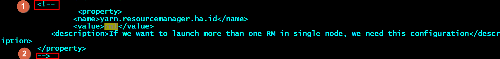
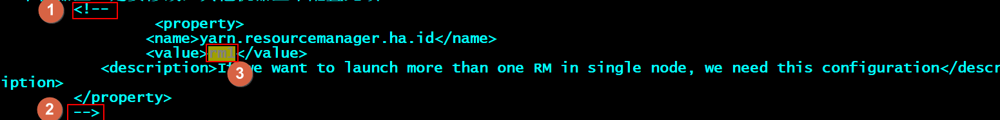
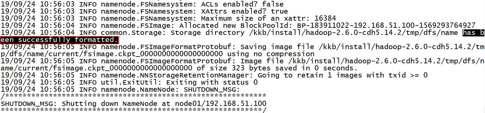
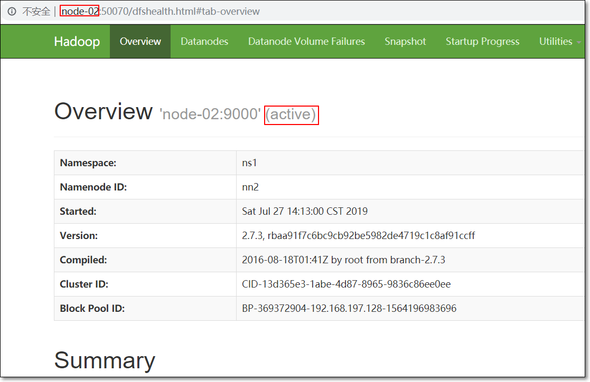
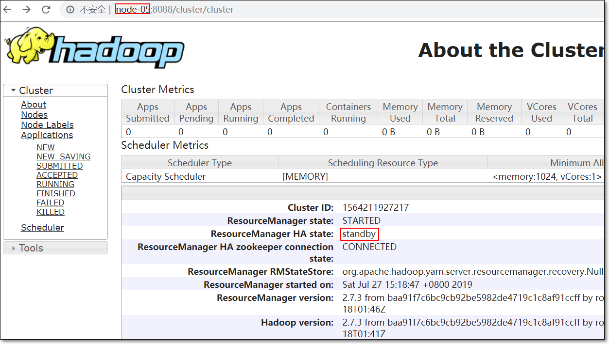
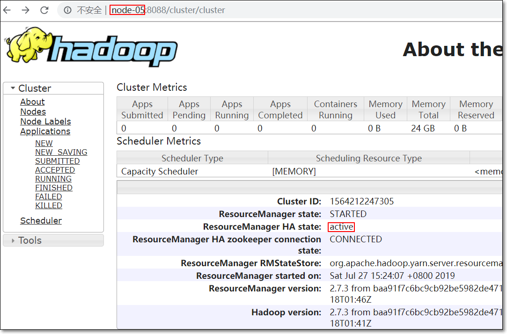
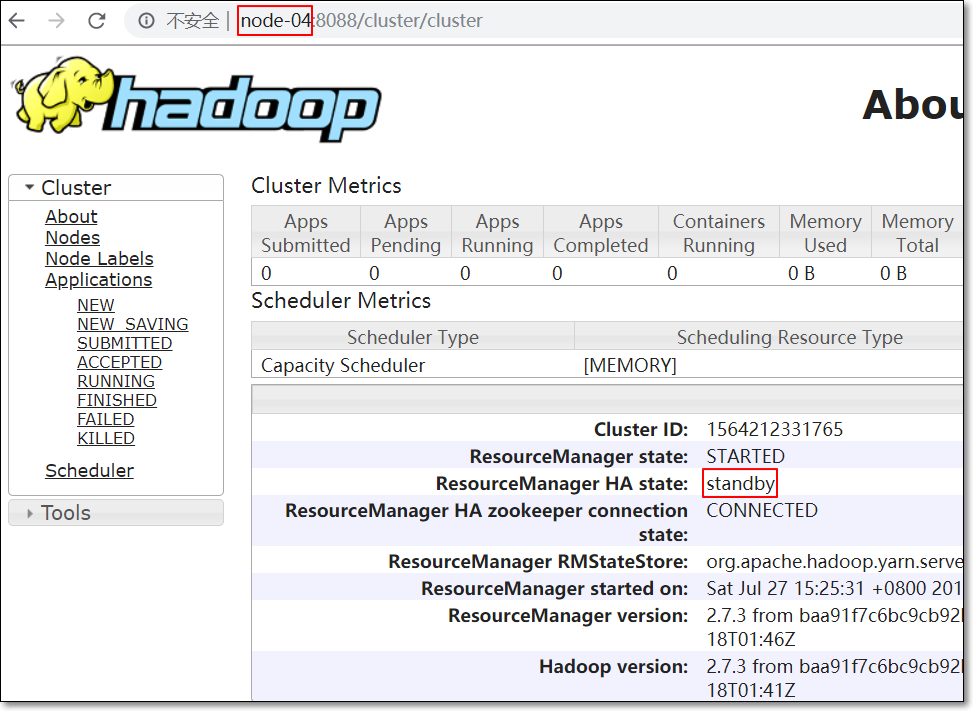

# 5节点Hadoop-2.6.0-cdh5.14.2 HA集群搭建

> <font color=red>**注意：**</font>
>
> 1、搭建集群需要细心；
>
> 2、请仔细阅读此文档中<font color=red>**加粗、加红**</font>的说明字体


# 一、集群规划

>  说明：
>
>  - 集群共5个节点，主机名分别是node01、node02、node03、node04、node05
>
>  - 初始启动集群
>    - node01上运行active namenode即主namenode；node02上运行standby namenode即从namenode
>    - node04上运行主resourcemanager；node05上运行从resourcemanager

- 每个节点运行的进程如下表

| 机器名 | 运行进程                                                    |
| ------ | ----------------------------------------------------------- |
| node01 | NameNode/zkfc/Zookeeper/Journalnode/DataNode/NodeManager    |
| node02 | NameNode/zkfc/Zookeeper/Journalnode/DataNode/NodeManager    |
| node03 | Zookeeper/Journalnode/DataNode/NodeManager/JobHistoryServer |
| node04 | ResourceManager                                             |
| node05 | ResourceManager                                             |


# 二、五节点Hadoop HA搭建

## 1. 虚拟机环境准备

- 准备**5台**虚拟机
- 在做五节点hadoop HA集群搭建之前，要求先完成**每台**虚拟机的**基本环境准备**
  - 每个节点都要做好“在node01上开始解压hadoop的tar.gz包之前的环境配置”
  - 主要包括如下步骤（三节点Hadoop集群搭建时已讲解过，不再赘述）
    - windows|mac安装VMWare虚拟化软件
    - VMWare下安装CenoOS7
    - 虚拟机关闭防火墙
    - 禁用selinux
    - 配置虚拟网卡
    - 配置虚拟机网络
    - 安装JDK
    - 配置时间同步
    - 修改主机名
    - 修改ip地址
    - 修改/etc/hosts
    - 各节点免密钥登陆
    - 重启虚拟机


## 2. 安装ZooKeeper集群

> Hadoop高可用集群需要使用ZooKeeper集群做分布式协调；所以先安装ZooKeeper集群

- 在node01、node02、node03上安装ZooKeeper集群（详见三节点ZooKeeper集群搭建，不再赘述）


## 3. 五节点Hadoop HA搭建

> **注意：**
>
> ①3.1到3.8在**node01**上操作
>
> ②**此文档使用<font color=red>普通用户</font>操作，如hadoop**
>
> ③**hadoop安装到用户主目录下，如/kkb/install**
>
> <font color=red>**请根据自己的实际情况修改**</font>


### 3.1 解压hadoop压缩包

- hadoop压缩包hadoop-2.6.0-cdh5.14.2_after_compile.tar.gz上传到node01的/kkb/soft路径中

- 解压hadoop压缩包到/kkb/install

```shell
#解压hadoop压缩包到/kkb/install
[hadoop@node01 ~]$ cd
[hadoop@node01 ~]$ cd /kkb/soft/
[hadoop@node01 soft]$ tar -xzvf hadoop-2.6.0-cdh5.14.2_after_compile.tar.gz -C /kkb/install/
```


### 3.2 修改hadoop-env.sh

- 进入hadoop配置文件路径$HADOOP_HOME/etc/hadoop

```shell
[hadoop@node01 soft]$ cd /kkb/install/hadoop-2.6.0-cdh5.14.2/
[hadoop@node01 hadoop-2.6.0-cdh5.14.2]$ cd etc/hadoop/
```

- 修改hadoop-env.sh，修改JAVA_HOME值为jdk解压路径；保存退出

```shell
export JAVA_HOME=/kkb/install/jdk1.8.0_141
```

> 注意：JAVA_HOME值修改为<font color=red>**自己jdk的实际目录**</font>

### 3.3 修改core-site.xml

> **注意：**
>
> **情况一：值/kkb/install/hadoop-2.6.0-cdh5.14.2/tmp根据实际情况修改**
>
> **情况二：值node01:2181,node02:2181,node03:2181根据实际情况修改，修改成安装了zookeeper的虚拟机的主机名**

```xml
<configuration>
	<!-- 指定hdfs的nameservice id为ns1 -->
	<property>
		<name>fs.defaultFS</name>
		<value>hdfs://ns1</value>
	</property>
	<!-- 指定hadoop临时文件存储的基目录 -->
	<property>
		<name>hadoop.tmp.dir</name>
		<value>/kkb/install/hadoop-2.6.0-cdh5.14.2/tmp</value>
	</property>
	<!-- 指定zookeeper地址，ZKFailoverController使用 -->
	<property>
		<name>ha.zookeeper.quorum</name>
		<value>node01:2181,node02:2181,node03:2181</value>
	</property>
</configuration>
```

### 3.4 修改hdfs-site.xml

> **注意：**
>
> **情况一：属性值qjournal://node01:8485;node02:8485;node03:8485/ns1中的主机名，修改成实际安装zookeeper的虚拟机的主机名**
>
> **情况二：属性值/kkb/install/hadoop-2.6.0-cdh5.14.2/journal中”/kkb/install/hadoop-2.6.0-cdh5.14.2”替换成实际hadoop文件夹的路径**
>
> **情况三：属性值/home/hadoop/.ssh/id_rsa中/home/hadoop根据实际情况替换**

```xml
<configuration>
	<!--指定hdfs的nameservice列表，多个之前逗号分隔；此处只有一个ns1，需要和core-site.xml中的保持一致 -->
	<property>
		<name>dfs.nameservices</name>
		<value>ns1</value>
	</property>
	<!-- ns1下面有两个NameNode，分别是nn1，nn2 -->
	<property>
		<name>dfs.ha.namenodes.ns1</name>
		<value>nn1,nn2</value>
	</property>
	<!-- nn1的RPC通信地址 -->
	<property>
		<name>dfs.namenode.rpc-address.ns1.nn1</name>
		<value>node01:8020</value>
	</property>
	<!-- nn1的http通信地址,web访问地址 -->
	<property>
		<name>dfs.namenode.http-address.ns1.nn1</name>
		<value>node01:50070</value>
	</property>
	<!-- nn2的RPC通信地址 -->
	<property>
		<name>dfs.namenode.rpc-address.ns1.nn2</name>
		<value>node02:8020</value>
	</property>
	<!-- nn2的http通信地址,web访问地址 -->
	<property>
		<name>dfs.namenode.http-address.ns1.nn2</name>
		<value>node02:50070</value>
	</property>
	<!-- 指定NameNode的元数据在JournalNode上的存放位置 -->
	<property>
		<name>dfs.namenode.shared.edits.dir</name>
		<value>qjournal://node01:8485;node02:8485;node03:8485/ns1</value>
	</property>
	<!-- 指定JournalNode在本地磁盘存放数据的位置 -->
	<property>
		<name>dfs.journalnode.edits.dir</name>
		<value>/kkb/install/hadoop-2.6.0-cdh5.14.2/journal</value>
	</property>
	<!-- 开启NameNode失败自动切换 -->
	<property>
		<name>dfs.ha.automatic-failover.enabled</name>
		<value>true</value>
	</property>
	<!-- 此类决定哪个namenode是active，切换active和standby -->
	<property>
		<name>dfs.client.failover.proxy.provider.ns1</name>
		<value>org.apache.hadoop.hdfs.server.namenode.ha.ConfiguredFailoverProxyProvider</value>
	</property>
	<!-- 配置隔离机制方法，多个机制用换行分割，即每个机制暂用一行-->
	<property>
		<name>dfs.ha.fencing.methods</name>
		<value>
		sshfence
		shell(/bin/true)
		</value>
	</property>
	<!-- 使用sshfence隔离机制时需要ssh免密登陆到目标机器 -->
	<property>
		<name>dfs.ha.fencing.ssh.private-key-files</name>
		<value>/home/hadoop/.ssh/id_rsa</value>
	</property>
	<!-- 配置sshfence隔离机制超时时间 -->
	<property>
		<name>dfs.ha.fencing.ssh.connect-timeout</name>
		<value>30000</value>
	</property>
</configuration>
```

### 3.5 修改mapred-site.xml

- 重命名文件

```shell
[hadoop@node01 hadoop]$ mv mapred-site.xml.template mapred-site.xml
```

- 修改mapred-site.xml

```xml
<configuration>
	<!-- 指定运行mr job的运行时框架为yarn -->
	<property>
		<name>mapreduce.framework.name</name>
		<value>yarn</value>
	</property>
    <!-- MapReduce JobHistory Server IPC host:port -->
	<property>
		<name>mapreduce.jobhistory.address</name>
		<value>node03:10020</value>
	</property>
	<!-- MapReduce JobHistory Server Web UI host:port -->
	<property>
		<name>mapreduce.jobhistory.webapp.address</name>
		<value>node03:19888</value>
	</property>
</configuration>
```

### 3.6 修改yarn-site.xml

> **注意：**
>
> **情况一：属性yarn.resourcemanager.hostname.rm1的值node04根据实际情况替换**
>
> **情况二：属性yarn.resourcemanager.hostname.rm2的值node05根据实际情况替换**
>
> **情况三：属性值node01:2181,node02:2181,node03:2181根据实际情况替换；替换成实际安装zookeeper的虚拟机的主机名**

```xml
<configuration>
    <!-- 是否启用日志聚合.应用程序完成后,日志汇总收集每个容器的日志,这些日志移动到文件系统,例如HDFS. -->
	<!-- 用户可以通过配置"yarn.nodemanager.remote-app-log-dir"、"yarn.nodemanager.remote-app-log-dir-suffix"来确定日志移动到的位置 -->
	<!-- 用户可以通过应用程序时间服务器访问日志 -->
	<!-- 启用日志聚合功能，应用程序完成后，收集各个节点的日志到一起便于查看 -->
	<property>
			<name>yarn.log-aggregation-enable</name>
			<value>true</value>
	</property>
	<!-- 开启RM高可靠 -->
	<property>
		<name>yarn.resourcemanager.ha.enabled</name>
		<value>true</value>
	</property>
	<!-- 指定RM的cluster id为yrc，意为yarn cluster -->
	<property>
		<name>yarn.resourcemanager.cluster-id</name>
		<value>yrc</value>
	</property>
	<!-- 指定RM的名字 -->
	<property>
		<name>yarn.resourcemanager.ha.rm-ids</name>
		<value>rm1,rm2</value>
	</property>
	<!-- 指定第一个RM的地址 -->
	<property>
		<name>yarn.resourcemanager.hostname.rm1</name>
		<value>node04</value>
	</property>
    <!-- 指定第二个RM的地址 -->
	<property>
		<name>yarn.resourcemanager.hostname.rm2</name>
		<value>node05</value>
	</property>
    <!-- 配置第一台机器的resourceManager通信地址 -->
	<!--客户端通过该地址向RM提交对应用程序操作-->
	<property>
		<name>yarn.resourcemanager.address.rm1</name>
		<value>node04:8032</value>
	</property>
	<!--向RM调度资源地址--> 
	<property>
		<name>yarn.resourcemanager.scheduler.address.rm1</name>
		<value>node04:8030</value>
	</property>
	<!--NodeManager通过该地址交换信息-->
	<property>
		<name>yarn.resourcemanager.resource-tracker.address.rm1</name>
		<value>node04:8031</value>
	</property>
	<!--管理员通过该地址向RM发送管理命令-->
	<property>
		<name>yarn.resourcemanager.admin.address.rm1</name>
		<value>node04:8033</value>
	</property>
	<!--RM HTTP访问地址,查看集群信息-->
	<property>
		<name>yarn.resourcemanager.webapp.address.rm1</name>
		<value>node04:8088</value>
	</property>
	<!-- 配置第二台机器的resourceManager通信地址 -->
	<property>
		<name>yarn.resourcemanager.address.rm2</name>
		<value>node05:8032</value>
	</property>
	<property>
		<name>yarn.resourcemanager.scheduler.address.rm2</name>
		<value>node05:8030</value>
	</property>
	<property>
		<name>yarn.resourcemanager.resource-tracker.address.rm2</name>
		<value>node05:8031</value>
	</property>
	<property>
		<name>yarn.resourcemanager.admin.address.rm2</name>
		<value>node05:8033</value>
	</property>
	<property>
		<name>yarn.resourcemanager.webapp.address.rm2</name>
		<value>node05:8088</value>
	</property>
    <!--开启resourcemanager自动恢复功能-->
	<property>
		<name>yarn.resourcemanager.recovery.enabled</name>
		<value>true</value>
	</property>	
    <!--在node4上配置rm1,在node5上配置rm2,注意：一般都喜欢把配置好的文件远程复制到其它机器上，但这个在YARN的另一个机器上一定要修改，其他机器上不配置此项-->
	<!--
    <property>       
		<name>yarn.resourcemanager.ha.id</name>
		<value>rm1</value>
	   <description>If we want to launch more than one RM in single node, we need this configuration</description>
	</property>
	-->
	<!--用于持久存储的类。尝试开启-->
	<property>
		<name>yarn.resourcemanager.store.class</name>
		<!-- 基于zookeeper的实现 -->
		<value>org.apache.hadoop.yarn.server.resourcemanager.recovery.ZKRMStateStore</value>
	</property>
    <!-- 单个任务可申请最少内存，默认1024MB -->
	<property>
		<name>yarn.scheduler.minimum-allocation-mb</name>
		<value>512</value>
	</property>
	<!--多长时间聚合删除一次日志 此处-->
	<property>
		<name>yarn.log-aggregation.retain-seconds</name>
		<value>2592000</value><!--30 day-->
	</property>
	<!--时间在几秒钟内保留用户日志。只适用于如果日志聚合是禁用的-->
	<property>
		<name>yarn.nodemanager.log.retain-seconds</name>
		<value>604800</value><!--7 day-->
	</property>
	<!-- 指定zk集群地址 -->
	<property>
		<name>yarn.resourcemanager.zk-address</name>
		<value>node01:2181,node02:2181,node03:2181</value>
	</property>
    <!-- 逗号隔开的服务列表，列表名称应该只包含a-zA-Z0-9_,不能以数字开始-->
	<property>
		<name>yarn.nodemanager.aux-services</name>
		<value>mapreduce_shuffle</value>
	</property>
</configuration>
```

### 3.7 修改slaves

> node01、node02、node03上运行了datanode、nodemanager，所以修改slaves内容**替换**为：

```shell
node01
node02
node03
```

### 3.8 远程拷贝hadoop文件夹

> 拷贝到node02~node05

```shell
[hadoop@node01 hadoop]$ scp -r /kkb/install/hadoop-2.6.0-cdh5.14.2/ node02:/kkb/install/
[hadoop@node01 hadoop]$ scp -r /kkb/install/hadoop-2.6.0-cdh5.14.2/ node03:/kkb/install/
[hadoop@node01 hadoop]$ scp -r /kkb/install/hadoop-2.6.0-cdh5.14.2/ node04:/kkb/install/
[hadoop@node01 hadoop]$ scp -r /kkb/install/hadoop-2.6.0-cdh5.14.2/ node05:/kkb/install/
```

### 3.9 修改两个RM的yarn-site.xml

- 在**node04**上，找到属性`yarn.resourcemanager.ha.id`去除注释①、②

```shell
[hadoop@node04 ~]$ cd /kkb/install/hadoop-2.6.0-cdh5.14.2/etc/hadoop
[hadoop@node04 hadoop]$ vim yarn-site.xml 
```



- 在**node05**上
  - 找到属性`yarn.resourcemanager.ha.id`去除注释**①、②**
  - **③**修改成rm2

```shell
[hadoop@node05 ~]$ cd /kkb/install/hadoop-2.6.0-cdh5.14.2/etc/hadoop/
[hadoop@node05 hadoop]$ vim yarn-site.xml
```



- 修改后，结果如下


### 3.10 配置环境变量

- **node01到node05<font color='red'>五个节点都配置环境变量</font>**

```shell
#将hadoop添加到环境变量中
vim /etc/profile
```

- 添加内容如下（注意：若HADOOP_HOME已经存在，则修改）：

```shell
export HADOOP_HOME=/kkb/install/hadoop-2.6.0-cdh5.14.2/
export PATH=$PATH:$HADOOP_HOME/bin:$HADOOP_HOME/sbin
```

- 编译文件，使新增环境变量生效

```shell
source /etc/profile
```

## 4. 启动与初始化hadoop集群

>  **注意：**严格按照下面的步骤 先检查各台hadoop环境变量是否设置好

### 4.1 启动zookeeper集群

>  注意：根据zookeeper实际安装情况，启动zookeeper

分别在node01、node02、node03上启动zookeeper

```shell
zkServer.sh start
```

#查看状态：一个为leader，另外两个为follower

```shell
zkServer.sh status
```

### 4.2 启动HDFS

#### 4.2.1 格式化ZK

> 在**node01**上执行即可
>
> - 集群有两个namenode，分别在node01、node02上
>
> - 每个namenode对应一个zkfc进程；
>
> - 在主namenode node01上格式化zkfc

```shell
hdfs zkfc -formatZK
```

#### 4.2.2 启动journalnode

- 在**node01**上执行
  - 会启动node01、node02、node03上的journalnode
  - 因为使用的是hadoop-daemon**s**.sh

```shell
hadoop-daemons.sh start journalnode
```

- 运行jps命令检验，node01、node02、node03上多了JournalNode进程

####  4.2.3 格式化HDFS

- 在node01上执行
- 根据集群规划node01、node02上运行namenode；所以<font color='red'>**只在主namenode节点**</font>即node01上执行命令:
  - 此命令慎用；只在集群搭建（初始化）时使用一次；
  - 一旦再次使用，会将HDFS上之前的数据格式化删除掉

```shell
hdfs namenode -format
```

- 下图表示格式化成功



#### 4.2.4 初始化元数据、启动主NN

- node01上执行（主namenode）

```shell
hdfs namenode -initializeSharedEdits -force
#启动HDFS
start-dfs.sh
```

#### 4.2.5 同步元数据信息、启动从NN

- **node02**上执行（从namenode）
- 同步元数据信息，并且设置node02上namenode为standBy状态

```shell
hdfs namenode -bootstrapStandby
hadoop-daemon.sh start namenode
```

#### 4.2.5 JPS查看进程

- node01上


- node02上


- node03上


### 4.3 启动YARN

#### 4.6.1 **主resourcemanager**

- **node04**上执行（**<font color='red'>主resourcemanager</font>**）
  - 把namenode和resourcemanager部署在不同节点，是因为性能问题，因为他们都要占用大量资源
  - <font color='red'>坑</font>：在node04上启动yarn之前，先依次从node04 ssh远程连接到node01、node02、node03、node04、node05；因为初次ssh时，需要交互，输入yes，回车

```shell
start-yarn.sh
```

#### 4.6.2 从resourcemanager

- 在<font color='red'>从resourcemanager</font>即**node05**上启动rm

```shell
yarn-daemon.sh start resourcemanager
```

#### 4.6.3 查看resourceManager状态

- node04上，它的resourcemanager的Id是rm1

```shell
yarn rmadmin -getServiceState rm1
```

- node05上，它的resourcemanager的Id是rm2

```shell
yarn rmadmin -getServiceState rm2
```

### 4.4 启动JobHistory

- **node03**上执行

```shell
mr-jobhistory-daemon.sh start historyserver
```


## 5. 验证集群是否可用

### 5.1 验证HDFS HA

#### 5.1.1 访问WEB UI

> node01、node02一主一备

```html
http://node01:50070
```


```
http://node02:50070
```


#### 5.1.2 模拟主备切换

- 在主namenode节点，运行

```shell
hadoop-daemon.sh stop namenode
```

- 访问之前为"备namenode"的WEB UI；发现状态更新为active

- 或者使用命令查看状态

```shell
hdfs haadmin -getServiceState nn2
```



- 启动刚才手动停掉的namenode

```shell
hadoop-daemon.sh start namenode
```

- 访问它的WEB UI，发现状态更新为standby

- 或者使用命令查看状态

```
hdfs haadmin -getServiceState nn1
```


### 5.2 验证Yarn HA

> node04、node05主备切换

#### 5.2.1 访问WEB UI

- node04浏览器访问

```
http://node04:8088/cluster/cluster
```


- node05浏览器访问

```
http://node05:8088/cluster/cluster
```



#### 5.2.2 模拟主备切换

- 在主resourcemanager节点，运行

```shell
yarn-daemon.sh stop resourcemanager
```

- 访问之前为"备resourcemanager"的WEB UI；发现状态更新为active

- 或者命令查看状态

```shell
yarn rmadmin -getServiceState rm2
```



- 启动刚才手动停掉的resourcemanager

```shell
yarn-daemon.sh start resourcemanager
```

- 访问它的WEB UI，发现状态更新为standby

- 或者命令查看状态

```shell
yarn rmadmin -getServiceState rm1
```



#### 5.2.3 运行MR示例

- 运行一下hadoop示例中的WordCount程序：

```shell
hadoop fs -put /kkb/install/hadoop-2.6.0-cdh5.14.2/LICENSE.txt /
hadoop jar /kkb/install/hadoop-2.6.0-cdh5.14.2/share/hadoop/mapreduce/hadoop-mapreduce-examples-2.6.0-cdh5.14.2.jar wordcount /LICENSE.txt /w0727
```


## 6. 集群常用命令

### 6.1 关闭Hadoop HA集群

> 正确指令执行顺序如下

- 主namenode上运行

```shell
stop-dfs.sh
```

- 主resoucemanager上运行

```shell
stop-yarn.sh
```

- 从resoucemanager上运行

```shell
yarn-daemon.sh stop resourcemanager
```

- 关闭zookeeper集群；每个zk服务器运行

```shell
zkServer.sh stop
```

### 6.2 常用命令

- 单独启动namenode

```shell
hadoop-daemon.sh start namenode
```

- 单独启动datanode

```shell
hadoop-daemon.sh start datanode
```

- 单独启动journalnode

```shell
hadoop-daemon.sh start journalnode
```

- 启动zookeeper

```shell
./zkServer.sh start
```

- 启动hdfs

```shell
start-dfs.sh
```

- 启动yarn

```shell
start-yarn.sh
```

- 单独启动resorucemanager

```shell
yarn-daemon.sh start resouremanger
```

- 查看namenode状态（namenode1）

```shell
hdfs haadmin -getServiceState nn1
```

- 查看resourcemanager状态（resourcemanager2）

```shell
yarn rmadmin -getServiceState rm2
```

