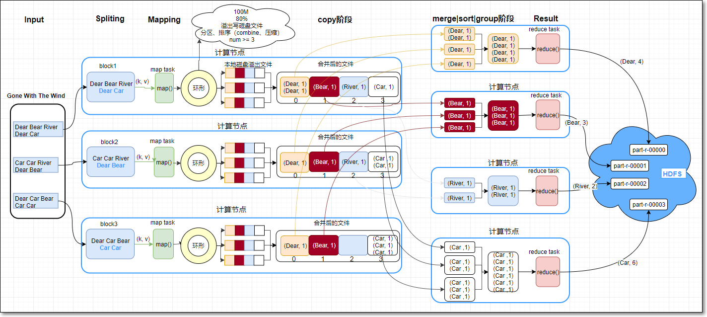
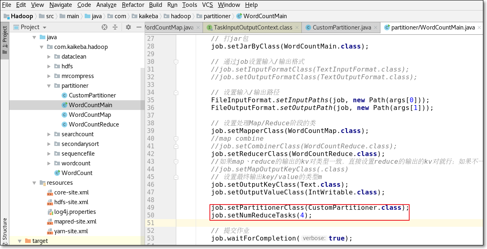
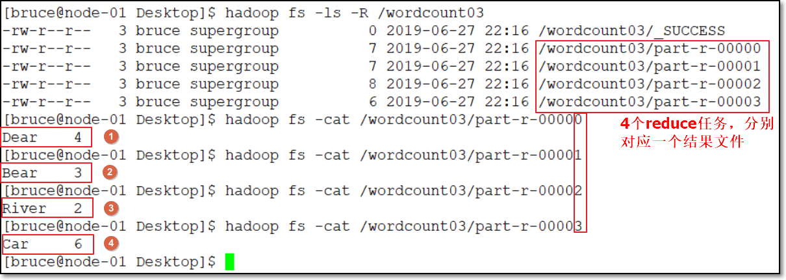
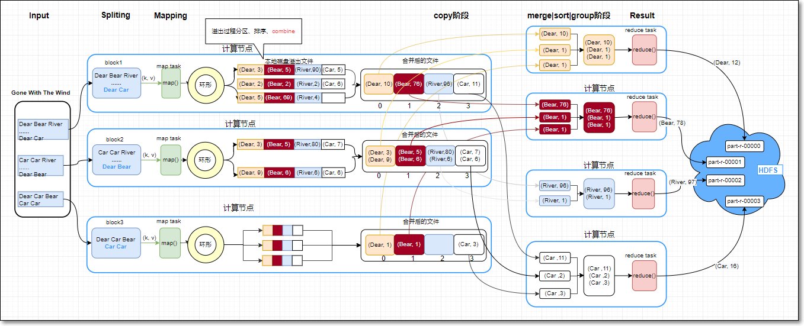
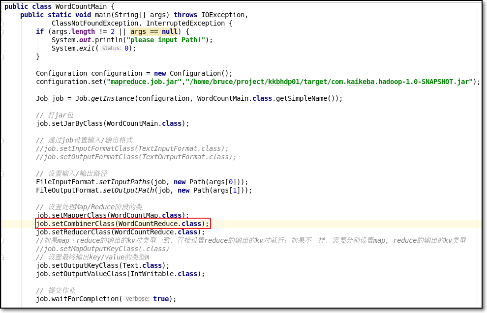
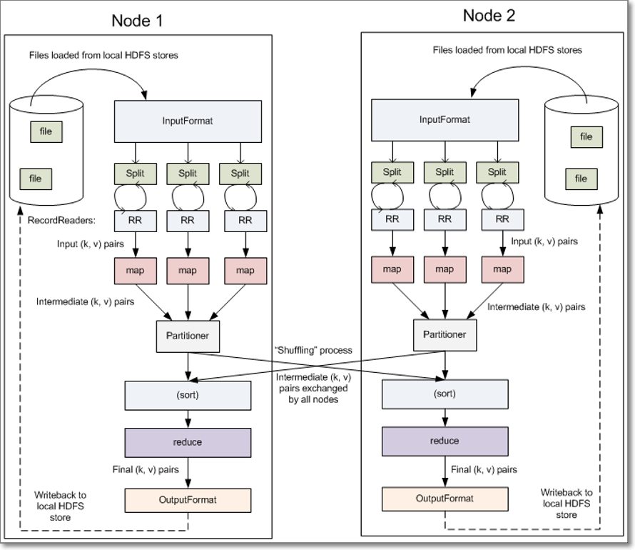
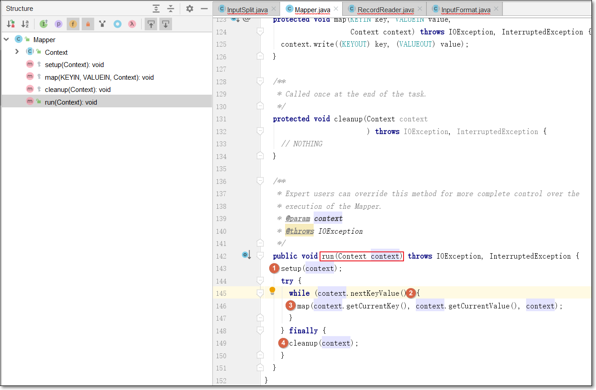
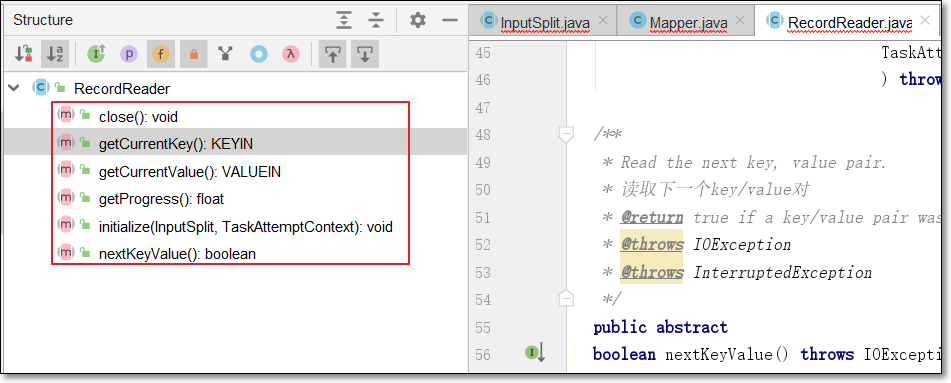

# MapReduce编程模型

### 7. 自定义分区（重点 15分钟）

#### 7.1 分区原理

- 根据之前讲的shuffle，我们知道在map任务中，从环形缓冲区溢出写磁盘时，会先对kv对数据进行分区操作

- 分区操作是由MR中的分区器负责的

- MapReduce有自带的默认分区器：

  - **HashPartitioner**
  - 关键方法getPartition返回当前键值对的**分区索引**(partition index)

  ```java
  public class HashPartitioner<K2, V2> implements Partitioner<K2, V2> {
  
    public void configure(JobConf job) {}
  
    /** Use {@link Object#hashCode()} to partition. */
    public int getPartition(K2 key, V2 value, int numReduceTasks) {
      return (key.hashCode() & Integer.MAX_VALUE) % numReduceTasks;
    }
  }
  ```

- 环形缓冲区溢出写磁盘前，将每个kv对，作为getPartition()的参数传入；

- 先对键值对中的key求hash值，与MAX_VALUE按位与；再模上reduce task个数（可在程序中使用job.setNumReduceTasks(4)指定reduce task个数为4）；

- 假设reduce task个数设置为4，则结果有四种：0、1、2、3

- 根据计算结果，决定此kv对，落入哪个分区，最终被相应的reduce task取走




- 若是MR默认分区器，不满足需求；可根据业务逻辑，设计自定义分区器，比如实现图上的功能

#### 7.2 默认分区

> 程序执行略
>
> 代码详见工程com.kaikeba.hadoop.partitioner包

- MR读取三个文件part1.txt、part2.txt、part3.txt；三个文件放到HDFS目录：/customParttitioner中

  
  
- part1.txt内容如下：

  ```
  Dear Bear River
  Dear Car
  ```
  
- part2.txt内容如下：

  ```
  Car Car River
  Dear Bear
  ```

- part3.txt内容如下：

  ```
  Dear Car Bear
  Car Car
  ```

  

- 默认HashPartitioner分区时，查看结果（看代码）


- 运行参数：

```shell
/customParttitioner /cp01
```

- 打jar包运行，结果如下：


> 只有part-r-00001、part-r-00003有数据；另外两个没有数据
>
> HashPartitioner将Bear分到index=1的分区；将Car|Dear|River分到index=3分区

#### 7.3 自定义分区

**7.3.1** 需求

- 自定义分区，使得文件中，分别以Dear、Bear、River、Car为键的键值对，分别落到index是0、1、2、3的分区中

**7.3.2** 逻辑分析

- 若要实现以上的分区策略，需要自定义分区类，此类继承Partitioner类，在getPartition中实现分区逻辑
- main方法中
  - **设定reduce个数**为4
  - 设置自定义的分区类，调用job.setPartitionerClass方法

**7.3.3** MR代码

> 完整代码见代码工程

- 自定义分区类如下

```java
package com.kaikeba.hadoop.partitioner;

import org.apache.hadoop.io.IntWritable;
import org.apache.hadoop.io.Text;
import org.apache.hadoop.mapreduce.Partitioner;

import java.util.HashMap;

public class CustomPartitioner extends Partitioner<Text, IntWritable> {
    public static HashMap<String, Integer> dict = new HashMap<String, Integer>();

    //定义每个键对应的分区index，使用map数据结构完成
    static{
        dict.put("Dear", 0);
        dict.put("Bear", 1);
        dict.put("River", 2);
        dict.put("Car", 3);
    }

    public int getPartition(Text text, IntWritable intWritable, int i) {
        //
        int partitionIndex = dict.get(text.toString());
        return partitionIndex;
    }
}
```




- 运行结果



> 结果满足需求

#### 7.4 总结

- 如果默认分区器不满足业务需求，可以自定义分区器
  - 自定义分区器的类继承Partitioner类
  - 覆写getPartition()，在方法中，定义自己的分区策略
  - 在main()方法中调用job.setPartitionerClass()
  - main()中设置reduce任务数


### 8. 自定义Combiner（重点 15分钟）

#### 8.1 需求

- 普通的MR是reduce通过http，取得map任务的分区结果；具体的聚合出结果是在reduce端进行的；

- 以单词计数为例：
  - 下图中的第一个map任务(map1)，本地磁盘中的结果有5个键值对：(Dear, 1)、(Bear, 1)、(River, 1)、(Dear, 1)、(Car, 1)
  - 其中，map1中的两个相同的键值对(Dear, 1)、(Dear, 1)，会被第一个reduce任务(reduce1)通过网络拉取到reduce1端
  - 那么假设map1中(Dear, 1)有1亿个呢？按原思路，map1端需要存储1亿个(Dear, 1)，再将1亿个(Dear, 1)通过网络被reduce1获得，然后再在reduce1端汇总
  - 这样做map端本地磁盘IO、数据从map端到reduce端传输的网络IO比较大
  - 那么想，能不能在reduce1从map1拉取1亿个(Dear, 1)之前，在map端就提前先做下reduce汇总，得到结果(Dear, 100000000)，然后再将这个结果（一个键值对）传输到reduce1呢？
  - 答案是可以的
  - 我们称之为combine操作
  
- map端combine本地聚合（本质是reduce，只不过在map端，我们称之为combine）

  

#### 8.2 逻辑分析

- 注意：

  - **不论运行多少次Combine操作，都不能影响最终的结果**

  - 并非所有的mr都适合combine操作，比如求平均值 

    **参考：《并非所有MR都适合combine.txt》**

- 原理图

  > 看原图



- 当每个map任务的环形缓冲区添满80%，开始溢写磁盘文件

- 此过程会分区、每个分区内按键排序、再combine操作（若设置了combine的话）、若设置map输出压缩的话则再压缩

  - 在合并溢写文件时，如果至少有3个溢写文件，并且设置了map端combine的话，会在合并的过程中触发combine操作；
  - 但是若只有2个或1个溢写文件，则不触发combine操作（因为combine操作，本质上是一个reduce，需要启动JVM虚拟机，有一定的开销）

- combine本质上也是reduce；因为自定义的combine类继承自Reducer父类

- map: (K1, V1) -> list(K2, V2)

- combiner: (K2, list(V2)) -> list(K2, V2)

- reduce: (K2, list(V2)) -> list(K3, V3)

  - reduce函数与combine函数通常是一样的，此时，K3与K2类型相同；
  - V3与V2类型相同
  
  

#### 8.3 MR代码

> 对原词频统计代码做修改；
>
> 详细代码见代码工程

- WordCountMap、WordCountReduce代码保持不变
- 唯一需要做的修改是在WordCountMain中，增加job.**setCombinerClass**(WordCountReduce.class);
- 修改如下：



#### 8.4 小结

- 使用combine时，首先考虑当前MR是否适合combine；总原则是不论使不使用combine不能影响最终的结果

- 在MR时，发生数据倾斜，且可以使用combine时，可以使用combine缓解数据倾斜


### 9. MR压缩（15分钟）

#### 9.1 需求

- 作用：在MR中，为了减少磁盘IO及网络IO，可考虑在map端、reduce端设置压缩功能
- 给“MapReduce编程：用户搜索次数”代码，增加压缩功能

#### 9.2 逻辑分析

- 那么如何设置压缩功能呢？只需在main方法中，给Configuration对象增加如下设置即可


```java
//开启map输出进行压缩的功能
configuration.set("mapreduce.map.output.compress", "true");
//设置map输出的压缩算法是：BZip2Codec，它是hadoop默认支持的压缩算法，且支持切分
configuration.set("mapreduce.map.output.compress.codec", "org.apache.hadoop.io.compress.BZip2Codec");
//开启job输出压缩功能
configuration.set("mapreduce.output.fileoutputformat.compress", "true");
//指定job输出使用的压缩算法
configuration.set("mapreduce.output.fileoutputformat.compress.codec", "org.apache.hadoop.io.compress.BZip2Codec");
```

#### 9.3 MR代码

- 给“MapReduce编程：用户搜索次数”代码，增加压缩功能，代码如下

  > 如何打jar包，已演示过，此处不再赘述

```java
package com.kaikeba.hadoop.mrcompress;

import org.apache.hadoop.conf.Configuration;
import org.apache.hadoop.fs.Path;
import org.apache.hadoop.io.IntWritable;
import org.apache.hadoop.io.LongWritable;
import org.apache.hadoop.io.Text;
import org.apache.hadoop.mapreduce.Job;
import org.apache.hadoop.mapreduce.Mapper;
import org.apache.hadoop.mapreduce.Reducer;
import org.apache.hadoop.mapreduce.lib.input.FileInputFormat;
import org.apache.hadoop.mapreduce.lib.output.FileOutputFormat;

import java.io.IOException;

/**
 * 本MR示例，用于统计每个用户搜索并查看URL链接的次数
 */
public class UserSearchCount {
    public static void main(String[] args) throws IOException, ClassNotFoundException, InterruptedException {
        //判断以下，输入参数是否是两个，分别表示输入路径、输出路径
        if (args.length != 2 || args == null) {
            System.out.println("please input Path!");
            System.exit(0);
        }

        Configuration configuration = new Configuration();
        //configuration.set("mapreduce.job.jar","/home/hadoop/IdeaProjects/Hadoop/target/com.kaikeba.hadoop-1.0-SNAPSHOT.jar");
        //开启map输出进行压缩的功能
        configuration.set("mapreduce.map.output.compress", "true");
        //设置map输出的压缩算法是：BZip2Codec，它是hadoop默认支持的压缩算法，且支持切分
        configuration.set("mapreduce.map.output.compress.codec", "org.apache.hadoop.io.compress.BZip2Codec");
        //开启job输出压缩功能
        configuration.set("mapreduce.output.fileoutputformat.compress", "true");
        //指定job输出使用的压缩算法
        configuration.set("mapreduce.output.fileoutputformat.compress.codec", "org.apache.hadoop.io.compress.BZip2Codec");

        //调用getInstance方法，生成job实例
        Job job = Job.getInstance(configuration, UserSearchCount.class.getSimpleName());

        //设置jar包，参数是包含main方法的类
        job.setJarByClass(UserSearchCount.class);

        //通过job设置输入/输出格式
        //MR的默认输入格式是TextInputFormat，所以下两行可以注释掉
//        job.setInputFormatClass(TextInputFormat.class);
//        job.setOutputFormatClass(TextOutputFormat.class);

        //设置输入/输出路径
        FileInputFormat.setInputPaths(job, new Path(args[0]));
        FileOutputFormat.setOutputPath(job, new Path(args[1]));

//        FileOutputFormat.setCompressOutput(job, true);
//        FileOutputFormat.setOutputCompressorClass(job, BZip2Codec.class);

        //设置处理Map阶段的自定义的类
        job.setMapperClass(SearchCountMapper.class);
        //设置map combine类，减少网路传出量
        //job.setCombinerClass(WordCountReduce.class);
        //设置处理Reduce阶段的自定义的类
        job.setReducerClass(SearchCountReducer.class);

        //如果map、reduce的输出的kv对类型一致，直接设置reduce的输出的kv对就行；如果不一样，需要分别设置map, reduce的输出的kv类型
        //注意：此处设置的map输出的key/value类型，一定要与自定义map类输出的kv对类型一致；否则程序运行报错
//        job.setMapOutputKeyClass(Text.class);
//        job.setMapOutputValueClass(IntWritable.class);

        //设置reduce task最终输出key/value的类型
        //注意：此处设置的reduce输出的key/value类型，一定要与自定义reduce类输出的kv对类型一致；否则程序运行报错
        job.setOutputKeyClass(Text.class);
        job.setOutputValueClass(IntWritable.class);

        // 提交作业
        job.waitForCompletion(true);
    }

    public static class SearchCountMapper extends Mapper<LongWritable, Text, Text, IntWritable> {
        //定义共用的对象，减少GC压力
        Text userIdKOut = new Text();
        IntWritable vOut = new IntWritable(1);

        @Override
        protected void map(LongWritable key, Text value, Context context) throws IOException, InterruptedException {
            //获得当前行的数据
            //样例数据：20111230111645  169796ae819ae8b32668662bb99b6c2d        塘承高速公路规划线路图  1       1       http://auto.ifeng.com/roll/20111212/729164.shtml
            String line = value.toString();

            //切分，获得各字段组成的数组
            String[] fields = line.split("\t");

            //因为要统计每个user搜索并查看URL的次数，所以将userid放到输出key的位置
            //注意：MR编程中，根据业务需求设计key是很重要的能力
            String userid = fields[1];

            //设置输出的key的值
            userIdKOut.set(userid);
            //输出结果
            context.write(userIdKOut, vOut);
        }
    }

    public static class SearchCountReducer extends Reducer<Text, IntWritable, Text, IntWritable> {
        //定义共用的对象，减少GC压力
        IntWritable totalNumVOut = new IntWritable();

        @Override
        protected void reduce(Text key, Iterable<IntWritable> values, Context context) throws IOException, InterruptedException {
            int sum = 0;

            for(IntWritable value: values) {
                sum += value.get();
            }

            //设置当前user搜索并查看总次数
            totalNumVOut.set(sum);
            context.write(key, totalNumVOut);
        }
    }
}
```

- 生成jar包，并运行jar包

```shell
[hadoop@node01 target]$ hadoop jar com.kaikeba.hadoop-1.0-SNAPSHOT.jar com.kaikeba.hadoop.mrcompress.UserSearchCount /sogou.2w.utf8 /compressed
```

- 查看结果

  > 可增加数据量，查看使用压缩算法前后的系统各计数器的数据量变化

```shell
[hadoop@node01 target]$ hadoop fs -ls -h /compressed
```


#### 9.4 总结

- MR过程中使用压缩可减少数据量，进而减少磁盘IO、网络IO数据量
- 可设置map端输出的压缩
- 可设置job最终结果的压缩
- 通过相应的配置项即可实现


### 10. 自定义InputFormat（难点 25分钟）

#### 10.1 MapReduce执行过程



- 上图也描述了mapreduce的一个完整的过程；我们主要看map任务是如何从hdfs读取分片数据的部分

  - 涉及3个关键的类
  - InputFormat输入格式类
    - InputSplit输入分片类
    - RecordReader记录读取器类
  - InputFormat输入格式类将输入文件分成一个个分片InputSplit
  - 每个Map任务对应一个split分片
  - RecordReader（记录读取器）读取分片数据，一行记录生成一个键值对
  - 传入map任务的map()方法，调用map()

- 所以，如果需要根据自己的业务情况，自定义输入的话，需要自定义两个类：
  - InputFormat类
  - RecordReader类

- 详细流程：

  - 客户端调用InputFormat的**getSplits()**方法，获得输入文件的分片信息

    

  - 针对每个MR job会生成一个相应的app master，负责map\reduce任务的调度及监控执行情况

  - 将分片信息传递给MR job的app master

  - app master根据分片信息，尽量将map任务尽量调度在split分片数据所在节点（**移动计算不移动数据**）

    

  - 有几个分片，就生成几个map任务
  
  - 每个map任务将split分片传递给createRecordReader()方法，生成此分片对应的RecordReader
  
  - RecordReader用来读取分片的数据，生成记录的键值对
  
    - nextKeyValue()判断是否有下一个键值对，如果有，返回true；否则，返回false
    - 如果返回true，调用getCurrentKey()获得当前的键
    - 调用getCurrentValue()获得当前的值
  
  - map任务运行过程
  
    
  
    - map任务运行时，会调用run()
  
    - 首先运行一次setup()方法；只在map任务启动时，运行一次；一些初始化的工作可以在setup方法中完成；如要连接数据库之类的操作
  
    - while循环，调用context.nextKeyValue()；会委托给RecordRecord的nextKeyValue()，判断是否有下一个键值对
  
    - 如果有下一个键值对，调用context.getCurrentKey()、context.getCurrentValue()获得当前的键、值的值（也是调用RecordReader的同名方法）
  
      
  
    - 作为参数传入map(key, value, context)，调用一次map()
  
    - 当读取分片尾，context.nextKeyValue()返回false；退出循环
  
    - 调用cleanup()方法，只在map任务结束之前，调用一次；所以，一些回收资源的工作可在此方法中实现，如关闭数据库连接

#### 10.2 需求

- 无论hdfs还是mapreduce，处理小文件都有损效率，实践中，又难免面临处理大量小文件的场景，此时，就需要有相应解决方案

#### 10.3 逻辑分析

- 小文件的优化无非以下几种方式：
  - 在数据采集的时候，就将小文件或小批数据合成大文件再上传HDFS(SequenceFile方案)
  - 在业务处理之前，在HDFS上使用mapreduce程序对小文件进行合并；可使用**自定义InputFormat**实现
  - 在mapreduce处理时，可采用**CombineFileInputFormat**提高效率
- 本例使用第二种方案，自定义输入格式

#### 10.4 MR代码

- 自定义InputFormat

  ```java
  package com.kaikeba.hadoop.inputformat;
  
  import org.apache.hadoop.fs.Path;
  import org.apache.hadoop.io.BytesWritable;
  import org.apache.hadoop.io.NullWritable;
  import org.apache.hadoop.mapreduce.InputSplit;
  import org.apache.hadoop.mapreduce.JobContext;
  import org.apache.hadoop.mapreduce.RecordReader;
  import org.apache.hadoop.mapreduce.TaskAttemptContext;
  import org.apache.hadoop.mapreduce.lib.input.FileInputFormat;
  
  import java.io.IOException;
  
  /**
   * 自定义InputFormat类；
   * 泛型：
   *  键：因为不需要使用键，所以设置为NullWritable
   *  值：值用于保存小文件的内容，此处使用BytesWritable
   */
  public class WholeFileInputFormat extends FileInputFormat<NullWritable, BytesWritable> {
  
      /**
       *
       * 返回false，表示输入文件不可切割
       * @param context
       * @param file
       * @return
       */
      @Override
      protected boolean isSplitable(JobContext context, Path file) {
          return false;
      }
  
      /**
       * 生成读取分片split的RecordReader
       * @param split
       * @param context
       * @return
       * @throws IOException
       * @throws InterruptedException
       */
      @Override
      public RecordReader<NullWritable, BytesWritable> createRecordReader(InputSplit split, TaskAttemptContext context) throws IOException,InterruptedException {
          //使用自定义的RecordReader类
          WholeFileRecordReader reader = new WholeFileRecordReader();
          //初始化RecordReader
          reader.initialize(split, context);
          return reader;
      }
  }
  ```

- 自定义RecordReader

  实现6个相关方法

  ```java
  package com.kaikeba.hadoop.inputformat;
  
  import org.apache.hadoop.conf.Configuration;
  import org.apache.hadoop.fs.FSDataInputStream;
  import org.apache.hadoop.fs.FileSystem;
  import org.apache.hadoop.fs.Path;
  import org.apache.hadoop.io.BytesWritable;
  import org.apache.hadoop.io.IOUtils;
  import org.apache.hadoop.io.NullWritable;
  import org.apache.hadoop.mapreduce.InputSplit;
  import org.apache.hadoop.mapreduce.RecordReader;
  import org.apache.hadoop.mapreduce.TaskAttemptContext;
  import org.apache.hadoop.mapreduce.lib.input.FileSplit;
  
  import java.io.IOException;
  
  /**
   *
   * RecordReader的核心工作逻辑：
   * 通过nextKeyValue()方法去读取数据构造将返回的key   value
   * 通过getCurrentKey 和 getCurrentValue来返回上面构造好的key和value
   *
   * @author
   */
  public class WholeFileRecordReader extends RecordReader<NullWritable, BytesWritable> {
  
      //要读取的分片
      private FileSplit fileSplit;
      private Configuration conf;
  
      //读取的value数据
      private BytesWritable value = new BytesWritable();
      /**
       *
       * 标识变量，分片是否已被读取过；因为小文件设置成了不可切分，所以一个小文件只有一个分片；
       * 而这一个分片的数据，只读取一次，一次读完所有数据
       * 所以设置此标识
       */
      private boolean processed = false;
  
      /**
       * 初始化
       * @param split
       * @param context
       * @throws IOException
       * @throws InterruptedException
       */
      @Override
      public void initialize(InputSplit split, TaskAttemptContext context)
              throws IOException, InterruptedException {
          this.fileSplit = (FileSplit) split;
          this.conf = context.getConfiguration();
      }
  
      /**
       * 判断是否有下一个键值对。若有，则读取分片中的所有的数据
       * @return
       * @throws IOException
       * @throws InterruptedException
       */
      @Override
      public boolean nextKeyValue() throws IOException, InterruptedException {
          if (!processed) {
              byte[] contents = new byte[(int) fileSplit.getLength()];
              Path file = fileSplit.getPath();
              FileSystem fs = file.getFileSystem(conf);
              FSDataInputStream in = null;
              try {
                  in = fs.open(file);
                  IOUtils.readFully(in, contents, 0, contents.length);
                  value.set(contents, 0, contents.length);
              } finally {
                  IOUtils.closeStream(in);
              }
              processed = true;
              return true;
          }
          return false;
      }
  
      /**
       * 获得当前的key
       * @return
       * @throws IOException
       * @throws InterruptedException
       */
      @Override
      public NullWritable getCurrentKey() throws IOException,
              InterruptedException {
          return NullWritable.get();
      }
  
      /**
       * 获得当前的value
       * @return
       * @throws IOException
       * @throws InterruptedException
       */
      @Override
      public BytesWritable getCurrentValue() throws IOException,
              InterruptedException {
          return value;
      }
  
      /**
       * 获得分片读取的百分比；因为如果读取分片数据的话，会一次性的读取完；所以进度要么是1，要么是0
       * @return
       * @throws IOException
       */
      @Override
      public float getProgress() throws IOException {
          //因为一个文件作为一个整体处理，所以，如果processed为true，表示已经处理过了，进度为1；否则为0
          return processed ? 1.0f : 0.0f;
      }
  
      @Override
      public void close() throws IOException {
      }
  }
  ```

- main方法

  ```java
  package com.kaikeba.hadoop.inputformat;
  
  import org.apache.hadoop.conf.Configuration;
  import org.apache.hadoop.conf.Configured;
  import org.apache.hadoop.fs.Path;
  import org.apache.hadoop.io.BytesWritable;
  import org.apache.hadoop.io.NullWritable;
  import org.apache.hadoop.io.Text;
  import org.apache.hadoop.mapreduce.InputSplit;
  import org.apache.hadoop.mapreduce.Job;
  import org.apache.hadoop.mapreduce.Mapper;
  import org.apache.hadoop.mapreduce.lib.input.FileSplit;
  import org.apache.hadoop.mapreduce.lib.output.SequenceFileOutputFormat;
  import org.apache.hadoop.util.Tool;
  import org.apache.hadoop.util.ToolRunner;
  
  import java.io.IOException;
  
  /**
   * 让主类继承Configured类，实现Tool接口
   * 实现run()方法
   * 将以前main()方法中的逻辑，放到run()中
   * 在main()中，调用ToolRunner.run()方法，第一个参数是当前对象；第二个参数是输入、输出
   */
  public class SmallFiles2SequenceFile extends Configured implements Tool {
  
      /**
       * 自定义Mapper类
       * mapper类的输入键值对类型，与自定义InputFormat的输入键值对保持一致
       * mapper类的输出的键值对类型，分别是文件名、文件内容
       */
      static class SequenceFileMapper extends
              Mapper<NullWritable, BytesWritable, Text, BytesWritable> {
  
          private Text filenameKey;
  
          /**
           * 取得文件名
           * @param context
           * @throws IOException
           * @throws InterruptedException
           */
          @Override
          protected void setup(Context context) throws IOException,
                  InterruptedException {
              InputSplit split = context.getInputSplit();
              //获得当前文件路径
              Path path = ((FileSplit) split).getPath();
              filenameKey = new Text(path.toString());
          }
  
          @Override
          protected void map(NullWritable key, BytesWritable value,
                             Context context) throws IOException, InterruptedException {
              context.write(filenameKey, value);
          }
      }
  
      public int run(String[] args) throws Exception {
          Configuration conf = new Configuration();
          Job job = Job.getInstance(conf,"combine small files to sequencefile");
          job.setJarByClass(SmallFiles2SequenceFile.class);
  
          //设置自定义输入格式
          job.setInputFormatClass(WholeFileInputFormat.class);
  
          WholeFileInputFormat.addInputPath(job,new Path(args[0]));
          //设置输出格式SequenceFileOutputFormat及输出路径
          job.setOutputFormatClass(SequenceFileOutputFormat.class);
          SequenceFileOutputFormat.setOutputPath(job,new Path(args[1]));
  
          job.setOutputKeyClass(Text.class);
          job.setOutputValueClass(BytesWritable.class);
          job.setMapperClass(SequenceFileMapper.class);
          return job.waitForCompletion(true) ? 0 : 1;
      }
  
      public static void main(String[] args) throws Exception {
          int exitCode = ToolRunner.run(new SmallFiles2SequenceFile(),
                  args);
          System.exit(exitCode);
  
      }
  }
  ```

#### 10.5 总结

- 若要自定义InputFormat的话
  - 需要自定义InputFormat类，并覆写getRecordReader()方法
  - 自定义RecordReader类，实现方法
    - initialize()
    - nextKeyValue()
    - getCurrentKey()
    - getCurrentValue()
    - getProgress()
    - close()


