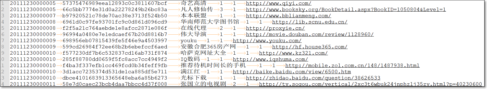
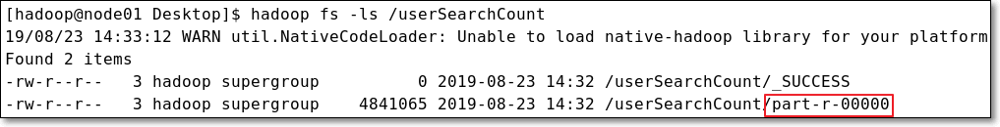

# MapReduce编程模型

### 4. MapReduce编程：数据清洗（10分钟）

>  mapreduce在企业中，可以用于对海量数据的数据清洗；当然，随着新一代大数据框架的出现，也可以使用spark、flink等框架，做数据清洗

#### 4.1 需求

- 现有一批日志文件，日志来源于用户使用搜狗搜索引擎搜索新闻，并点击查看搜索结果过程；
- 但是，日志中有一些记录损坏，现需要使用MapReduce来将这些**损坏记录**（如记录中少字段、多字段）从日志文件中删除，此过程就是传说中的**数据清洗**。
- 并且在清洗时，要**统计**损坏的记录数。

#### 4.2 数据结构

- 日志格式：每行记录有6个字段；分别表示时间datetime、用户ID userid、新闻搜索关键字searchkwd、当前记录在返回列表中的序号retorder、用户点击链接的顺序cliorder、点击的URL连接cliurl	

  

  关于**retorder、cliorder**说明：

  

#### 4.3 逻辑分析

- MapReduce程序一般分为map阶段，将任务分而治之；
- reduce阶段，将map阶段的结果进行聚合；
- 而有些mapreduce应用不需要数据聚合的操作，也就是说**不需要reduce阶段**。即编程时，不需要编写自定义的reducer类
- 而本例的数据清洗就是属于此种情况
- 统计损坏的记录数，可使用**自定义计数器**的方式进行
- map方法的逻辑：取得每一行数据，与每条记录的固定格式比对，是否符合；
  - 若符合，则是完好的记录；
  - 否则是损坏的记录。并对自定义计数器累加

#### 4.4 MR代码

> 将sogou.50w.utf8上传到HDFS根目录
>
> ```shell
> [hadoop@node01 soft]$ pwd
> /kkb/soft
> [hadoop@node01 soft]$ hadoop fs -put sogou.50w.utf8 /
> ```
>
> 给MR程序在IDEA中设置参数，运行等操作，与上边类似；不再赘述

**4.4.1 Mapper类**

> 具体逻辑，可详见代码注释
>
> 注意：实际工作中，写**良好的代码注释**也是基本的职业素养

```java
package com.kaikeba.hadoop.dataclean;

import org.apache.hadoop.conf.Configuration;
import org.apache.hadoop.fs.Path;
import org.apache.hadoop.io.LongWritable;
import org.apache.hadoop.io.NullWritable;
import org.apache.hadoop.io.Text;
import org.apache.hadoop.mapreduce.Counter;
import org.apache.hadoop.mapreduce.Job;
import org.apache.hadoop.mapreduce.Mapper;
import org.apache.hadoop.mapreduce.lib.input.FileInputFormat;
import org.apache.hadoop.mapreduce.lib.output.FileOutputFormat;

import java.io.IOException;

/**
 *
 * 现对sogou日志数据，做数据清洗；将不符合格式要求的数据删除
 * 每行记录有6个字段；
 * 分别表示时间datetime、用户ID userid、新闻搜索关键字searchkwd、当前记录在返回列表中的序号retorder、用户点击链接的顺序cliorder、点击的URL连接cliurl
 * 日志样本：
 * 20111230111308  0bf5778fc7ba35e657ee88b25984c6e9        nba直播 4       1       http://www.hoopchina.com/tv
 *
 */
public class DataClean {
    /**
     *
     * 基本上大部分MR程序的main方法逻辑，大同小异；将其他MR程序的main方法代码拷贝过来，稍做修改即可
     * 实际开发中，也会有很多的复制、粘贴、修改
     *
     * 注意：若要IDEA中，本地运行MR程序，需要将resources/mapred-site.xml中的mapreduce.framework.name属性值，设置成local
     * @param args
     */
    public static void main(String[] args) throws IOException, ClassNotFoundException, InterruptedException {

        //判断一下，输入参数是否是两个，分别表示输入路径、输出路径
        if (args.length != 2 || args == null) {
            System.out.println("please input Path!");
            System.exit(0);
        }

        Configuration configuration = new Configuration();

        //调用getInstance方法，生成job实例
        Job job = Job.getInstance(configuration, DataClean.class.getSimpleName());

        //设置jar包，参数是包含main方法的类
        job.setJarByClass(DataClean.class);

        //设置输入/输出路径
        FileInputFormat.setInputPaths(job, new Path(args[0]));
        FileOutputFormat.setOutputPath(job, new Path(args[1]));

        //设置处理Map阶段的自定义的类
        job.setMapperClass(DataCleanMapper.class);

        //注意：此处设置的map输出的key/value类型，一定要与自定义map类输出的kv对类型一致；否则程序运行报错
        job.setMapOutputKeyClass(Text.class);
        job.setMapOutputValueClass(NullWritable.class);

        //注意：因为不需要reduce聚合阶段，所以，需要显示设置reduce task个数是0
        job.setNumReduceTasks(0);

        // 提交作业
        job.waitForCompletion(true);
    }

    /**
     * 
     * 自定义mapper类
     * 注意：若自定义的mapper类，与main方法在同一个类中，需要将自定义mapper类，声明成static的
     */
    public static class DataCleanMapper extends Mapper<LongWritable, Text, Text, NullWritable> {
        //为了提高程序的效率，避免创建大量短周期的对象，出发频繁GC；此处生成一个对象，共用
        NullWritable nullValue = NullWritable.get();

        @Override
        protected void map(LongWritable key, Text value, Context context) throws IOException, InterruptedException {
            //自定义计数器，用于记录残缺记录数
            Counter counter = context.getCounter("DataCleaning", "damagedRecord");

            //获得当前行数据
            //样例数据：20111230111645  169796ae819ae8b32668662bb99b6c2d        塘承高速公路规划线路图  1       1       http://auto.ifeng.com/roll/20111212/729164.shtml
            String line = value.toString();

            //将行数据按照记录中，字段分隔符切分
            String[] fields = line.split("\t");

            //判断字段数组长度，是否为6
            if(fields.length != 6) {
                //若不是，则不输出，并递增自定义计数器
                counter.increment(1L);
            } else {
                //若是6，则原样输出
                context.write(value, nullValue);
            }
        }
    }
}

```

**4.4.2 运行结果**

> 仅以本地运行演示

- 运行参数

```
/sogou.50w.utf8 /dataClean
```

- ①reduce 0%，job就已经successfully，表示此MR程序没有reduce阶段
- ②DataCleaning是自定义计数器组名；damagedRecord是自定义的计数器；值为6，表示有6条损坏记录


- 图中part-**m**-00000中的**m**表示，此文件是由map任务生成

```shell
[hadoop@node01 Desktop]$ hadoop fs -ls /dataClean
```


- 查看生成的结果文件行数

```shell
[hadoop@node01 Desktop]$ hadoop fs -cat /dataClean/part-m-00000 | wc -l
```

> 日志文件，处理之前是50万行；
>
> 处理后，去掉6行损坏记录，剩余499994行记录


#### 4.5 总结

- MR可用于数据清洗；另外，也可以使用Spark、Flink等框架做数据清洗

- 可使用自定义计数器记录符合特定条件的记录数，用于统计


### 5. MapReduce编程：用户搜索次数（10分钟）

#### 5.1 需求

- 使用MR编程，统计sogou日志数据中，每个用户搜索的次数；结果写入HDFS

#### 5.2 数据结构

- 数据来源自“MapReduce编程：数据清洗”中的输出结果

- 仍然是sogou日志数据；不再赘述


#### 5.3 逻辑分析

- 还记得之前提到的MR中key的作用吗？
- MR编程时，若要针对某个值对数据进行分组、聚合时，如当前的词频统计例子，需要将每个单词作为reduce输入的key，从而按照单词分组，进而求出每组即每个单词的总次数
- 那么此例也是类似的。
  - 统计每个用户的搜索次数，将userid放到reduce输入的key的位置；
  - 对userid进行分组
  - 进而统计每个用户的搜索次数

#### 5.4 MR代码

> 给MR程序在IDEA中设置参数，运行等操作，与上边类似；不再赘述
>
> 此处MR程序的输入文件是“MapReduce编程：数据清洗”中的==输出结果文件/dataClean/part-m-00000==
>


```java
package com.kaikeba.hadoop.searchcount;

import org.apache.hadoop.conf.Configuration;
import org.apache.hadoop.fs.Path;
import org.apache.hadoop.io.IntWritable;
import org.apache.hadoop.io.LongWritable;
import org.apache.hadoop.io.Text;
import org.apache.hadoop.mapreduce.Job;
import org.apache.hadoop.mapreduce.Mapper;
import org.apache.hadoop.mapreduce.Reducer;
import org.apache.hadoop.mapreduce.lib.input.FileInputFormat;
import org.apache.hadoop.mapreduce.lib.output.FileOutputFormat;

import java.io.IOException;

/**
 *
 * 本MR示例，用于统计每个用户搜索并查看URL链接的次数
 */
public class UserSearchCount {

    public static void main(String[] args) throws IOException, ClassNotFoundException, InterruptedException {

        //判断一下，输入参数是否是两个，分别表示输入路径、输出路径
        if (args.length != 2 || args == null) {
            System.out.println("please input Path!");
            System.exit(0);
        }

        Configuration configuration = new Configuration();
        //configuration.set("mapreduce.job.jar","/home/hadoop/IdeaProjects/Hadoop/target/com.kaikeba.hadoop-1.0-SNAPSHOT.jar");

        //调用getInstance方法，生成job实例
        Job job = Job.getInstance(configuration, UserSearchCount.class.getSimpleName());

        //设置jar包，参数是包含main方法的类
        job.setJarByClass(UserSearchCount.class);

        //通过job设置输入/输出格式
        //MR的默认输入格式是TextInputFormat，输出格式是TextOutputFormat；所以下两行可以注释掉
//        job.setInputFormatClass(TextInputFormat.class);
//        job.setOutputFormatClass(TextOutputFormat.class);

        //设置输入/输出路径
        FileInputFormat.setInputPaths(job, new Path(args[0]));
        FileOutputFormat.setOutputPath(job, new Path(args[1]));

        //设置处理Map阶段的自定义的类
        job.setMapperClass(SearchCountMapper.class);
        //设置map combine类，减少网路传出量
        //job.setCombinerClass(WordCountReduce.class);
        //设置处理Reduce阶段的自定义的类
        job.setReducerClass(SearchCountReducer.class);

        //如果map、reduce的输出的kv对类型一致，直接设置reduce的输出的kv对就行；如果不一样，需要分别设置map, reduce的输出的kv类型
        //注意：此处设置的map输出的key/value类型，一定要与自定义map类输出的kv对类型一致；否则程序运行报错
//        job.setMapOutputKeyClass(Text.class);
//        job.setMapOutputValueClass(IntWritable.class);

        //设置reduce task最终输出key/value的类型
        //注意：此处设置的reduce输出的key/value类型，一定要与自定义reduce类输出的kv对类型一致；否则程序运行报错
        job.setOutputKeyClass(Text.class);
        job.setOutputValueClass(IntWritable.class);

        //提交作业
        job.waitForCompletion(true);
    }

    public static class SearchCountMapper extends Mapper<LongWritable, Text, Text, IntWritable> {

        //定义共用的对象，减少GC压力
        Text userIdKOut = new Text();
        IntWritable vOut = new IntWritable(1);

        @Override
        protected void map(LongWritable key, Text value, Context context) throws IOException, InterruptedException {

            //获得当前行的数据
            //样例数据：20111230111645  169796ae819ae8b32668662bb99b6c2d        塘承高速公路规划线路图  1       1       http://auto.ifeng.com/roll/20111212/729164.shtml
            String line = value.toString();

            //切分，获得各字段组成的数组
            String[] fields = line.split("\t");

            //因为要统计每个user搜索并查看URL的次数，所以将userid放到输出key的位置
            //注意：MR编程中，根据业务需求设计key是很重要的能力
            String userid = fields[1];

            //设置输出的key的值
            userIdKOut.set(userid);
            //输出结果
            context.write(userIdKOut, vOut);
        }
    }

    public static class SearchCountReducer extends Reducer<Text, IntWritable, Text, IntWritable> {

        //定义共用的对象，减少GC压力
        IntWritable totalNumVOut = new IntWritable();

        @Override
        protected void reduce(Text key, Iterable<IntWritable> values, Context context) throws IOException, InterruptedException {
            int sum = 0;

            for(IntWritable value: values) {
                sum += value.get();
            }

            //设置当前user搜索并查看总次数
            totalNumVOut.set(sum);
            context.write(key, totalNumVOut);
        }
    }
}
```

**5.4.1 结果**

- 运行参数

```
/dataClean/part-m-00000 /userSearchCount
```

- 运行结果

```shell
[hadoop@node01 Desktop]$ hadoop fs -ls /userSearchCount
```



#### 5.5 总结

- 结合本例子的需求，设计MR程序；因为要统计每个用户的搜索次数，所以最终userid作为reduce的输出的key
- MR编程能够根据业务需求设计合适的key是一个很重要的能力；而这是需要建立在自己地MR框架原理有清晰认识的基础之上的


