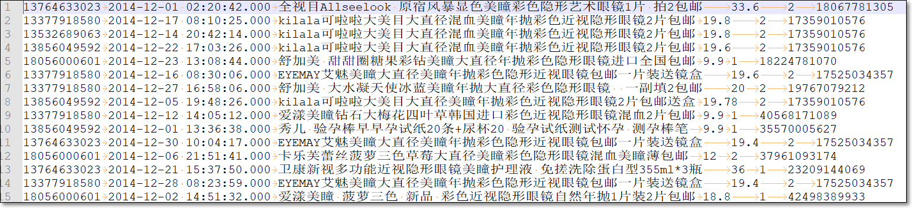
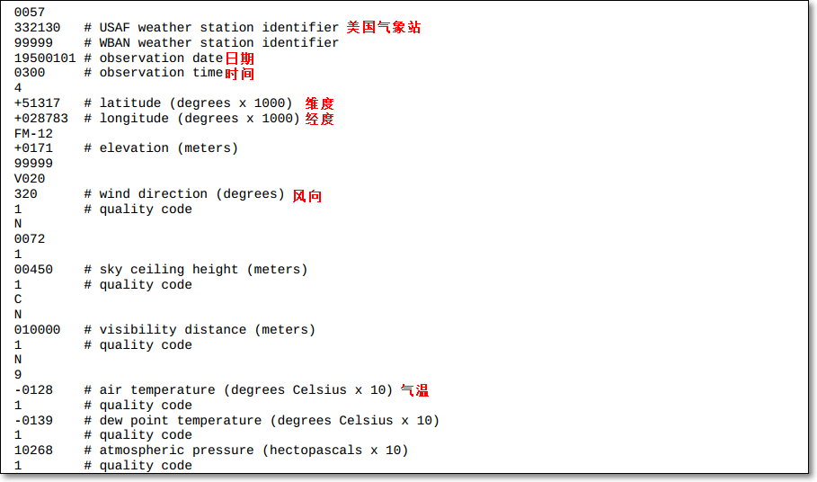

### 12. 二次排序（重点 20分钟）

#### 12.1 需求

- 如一个简单的关于员工工资的记录；每条记录如下，有3个字段，分别表示name、age、salary

  nancy	22	8000

- 使用MR处理记录，实现结果中

  - 按照工资从高到低的降序排序
  - 若工资相同，则按年龄升序排序

#### 12.2 逻辑分析

- MapReduce中，根据key进行分区、排序、分组

- 有些MR的输出的key可以直接使用hadoop框架的可序列化可比较类型表示，如Text、IntWritable等等，而这些类型本身是可比较的；如IntWritable默认升序排序

  

- 但有时，使用MR编程，输出的key，可能是一个自定义的类型（包含的是非单一信息，如包含工资、年龄）；并且也得是可序列化、可比较的

- 需要自定义key，定义排序规则

  - 实现：按照人的salary降序排序，若相同，则再按age升序排序；若salary、age相同，则放入同一组

#### 12.3 MR代码

- 详见工程代码
- Person

```java
package com.kaikeba.hadoop.secondarysort;

import org.apache.hadoop.io.WritableComparable;

import java.io.DataInput;
import java.io.DataOutput;
import java.io.IOException;

public class Person implements WritableComparable<Person> {
    private String name;
    private int age;
    private int salary;

    public Person() {
    }

    public Person(String name, int age, int salary) {
        //super();
        this.name = name;
        this.age = age;
        this.salary = salary;
    }

    public String getName() {
        return name;
    }

    public void setName(String name) {
        this.name = name;
    }

    public int getAge() {
        return age;
    }

    public void setAge(int age) {
        this.age = age;
    }

    public int getSalary() {
        return salary;
    }

    public void setSalary(int salary) {
        this.salary = salary;
    }

    @Override
    public String toString() {
        return this.salary + "  " + this.age + "    " + this.name;
    }

    //先比较salary，高的排序在前；若相同，age小的在前
    public int compareTo(Person o) {
        int compareResult1= this.salary - o.salary;
        if(compareResult1 != 0) {
            return -compareResult1;
        } else {
            return this.age - o.age;
        }
    }

    //序列化，将NewKey转化成使用流传送的二进制
    public void write(DataOutput dataOutput) throws IOException {
        dataOutput.writeUTF(name);
        dataOutput.writeInt(age);
        dataOutput.writeInt(salary);
    }

    //使用in读字段的顺序，要与write方法中写的顺序保持一致
    public void readFields(DataInput dataInput) throws IOException {
        //read string
        this.name = dataInput.readUTF();
        this.age = dataInput.readInt();
        this.salary = dataInput.readInt();
    }
}
```

- main类、mapper、reducer

```java
package com.kaikeba.hadoop.secondarysort;

import org.apache.hadoop.conf.Configuration;
import org.apache.hadoop.fs.FileSystem;
import org.apache.hadoop.fs.Path;
import org.apache.hadoop.io.LongWritable;
import org.apache.hadoop.io.NullWritable;
import org.apache.hadoop.io.Text;
import org.apache.hadoop.mapreduce.Job;
import org.apache.hadoop.mapreduce.Mapper;
import org.apache.hadoop.mapreduce.Reducer;
import org.apache.hadoop.mapreduce.lib.input.FileInputFormat;
import org.apache.hadoop.mapreduce.lib.output.FileOutputFormat;

import java.io.IOException;
import java.net.URI;

public class SecondarySort {

	public static void main(String[] args) throws Exception {
		Configuration configuration = new Configuration();
		//configuration.set("mapreduce.job.jar","/home/bruce/project/kkbhdp01/target/com.kaikeba.hadoop-1.0-SNAPSHOT.jar");
		Job job = Job.getInstance(configuration, SecondarySort.class.getSimpleName());

		FileSystem fileSystem = FileSystem.get(URI.create(args[1]), configuration);
		//慎用
		if (fileSystem.exists(new Path(args[1]))) {
			fileSystem.delete(new Path(args[1]), true);
		}

		FileInputFormat.setInputPaths(job, new Path(args[0]));
		job.setMapperClass(MyMap.class);
		job.setMapOutputKeyClass(Person.class);
		job.setMapOutputValueClass(NullWritable.class);
		
		//设置reduce的个数;默认为1
		//job.setNumReduceTasks(1);

		job.setReducerClass(MyReduce.class);
		job.setOutputKeyClass(Person.class);
		job.setOutputValueClass(NullWritable.class);
		FileOutputFormat.setOutputPath(job, new Path(args[1]));

		job.waitForCompletion(true);

	}

	public static class MyMap extends
			Mapper<LongWritable, Text, Person, NullWritable> {
		@Override
		protected void map(LongWritable key, Text value,
				Context context)
				throws IOException, InterruptedException {

			String[] fields = value.toString().split("\t");
			String name = fields[0];
			int age = Integer.parseInt(fields[1]);
			int salary = Integer.parseInt(fields[2]);
			//在自定义类中进行比较
			Person person = new Person(name, age, salary);

			context.write(person, NullWritable.get());
		}
	}

	public static class MyReduce extends
			Reducer<Person, NullWritable, Person, NullWritable> {
		@Override
		protected void reduce(Person key, Iterable<NullWritable> values, Context context) throws IOException, InterruptedException {
			context.write(key, NullWritable.get());
		}
	}
}
```

#### 12.4 总结

- 如果MR时，key的排序规则比较复杂，比如需要根据字段1排序，若字段1相同，则需要根据字段2排序...，此时，可以使用自定义key实现

- 将自定义的key作为MR中，map输出的key的类型（reduce输入的类型）


### 13. 自定义分组&topN（重难点 20分钟）

#### 13.1 需求

- 现有一个淘宝用户订单历史记录文件；每条记录有6个字段，分别表示

  - userid、datetime、title商品标题、unitPrice商品单价、purchaseNum购买量、productId商品ID

  

- 现使用MR编程，求出每个用户、每个月消费金额最多的两笔订单，花了多少钱

  - 所以得相同用户、同一个年月的数据，分到同一组

#### 13.2 逻辑分析

- 根据文件格式，自定义JavaBean类OrderBean
  - 实现WritableComparable接口
  - 包含6个字段分别对应文件中的6个字段
  - 重点实现compareTo方法
    - 先比较userid是否相等；若不相等，则userid升序排序
    - 若相等，比较两个Bean的日期是否相等；若不相等，则日期升序排序
    - 若相等，再比较总开销，降序排序
- 自定义分区类
  - 继承Partitioner类
  - getPartiton()实现，userid相同的，处于同一个分区
- 自定义Mapper类
  - 输出key是当前记录对应的Bean对象
  - 输出的value对应当前下单的总开销
- 自定义分组类
  - 决定userid相同、日期（年月）相同的记录，分到同一组中，被reduce()处理
- 自定义Reduce类
  - reduce()中求出当前一组数据中，开销头两笔的信息
- main方法
  - job.setMapperClass
  - job.setPartitionerClass
  - job.setReducerClass
  - job.setGroupingComparatorClass

#### 13.3 MR代码

> 详细代码见代码工程

- OrderBean

```java
package com.kaikeba.hadoop.grouping;

import org.apache.hadoop.io.WritableComparable;

import java.io.DataInput;
import java.io.DataOutput;
import java.io.IOException;

public class OrderBean implements WritableComparable<OrderBean> {

    private String userid;
    //year+month -> 201408
    private String datetime;
    private String title;
    private double unitPrice;
    private int purchaseNum;
    private String produceId;

    public OrderBean() {
    }

    public OrderBean(String userid, String datetime, String title, double unitPrice, int purchaseNum, String produceId) {
        super();
        this.userid = userid;
        this.datetime = datetime;
        this.title = title;
        this.unitPrice = unitPrice;
        this.purchaseNum = purchaseNum;
        this.produceId = produceId;
    }

    public int compareTo(OrderBean o) {
        //OrderBean作为MR中的key；如果对象中的userid相同，就表示两个对象是同一个key
        int ret1 = this.userid.compareTo(o.userid);

        if (ret1 == 0) {
            //如果userid相同，比较年月
            String thisYearMonth = this.getDatetime();
            String oYearMonth = o.getDatetime();
            int ret2 = thisYearMonth.compareTo(oYearMonth);

            if(ret2 == 0) {
                //如果userid、年月都形同，比较记录的开销
                Double thisTotalPrice = this.getPurchaseNum()*this.getUnitPrice();
                Double oTotalPrice = o.getPurchaseNum()*o.getUnitPrice();
                //总花销高的排在前边
                return -thisTotalPrice.compareTo(oTotalPrice);
            } else {
                return ret2;
            }
        } else {
            return ret1;
        }
    }

    /**
     * 序列化
     * @param dataOutput
     * @throws IOException
     */
    public void write(DataOutput dataOutput) throws IOException {
        dataOutput.writeUTF(userid);
        dataOutput.writeUTF(datetime);
        dataOutput.writeUTF(title);
        dataOutput.writeDouble(unitPrice);
        dataOutput.writeInt(purchaseNum);
        dataOutput.writeUTF(produceId);
    }

    /**
     * 反序列化
     * @param dataInput
     * @throws IOException
     */
    public void readFields(DataInput dataInput) throws IOException {
        this.userid = dataInput.readUTF();
        this.datetime = dataInput.readUTF();
        this.title = dataInput.readUTF();
        this.unitPrice = dataInput.readDouble();
        this.purchaseNum = dataInput.readInt();
        this.produceId = dataInput.readUTF();
    }

    /**
     * 使用默认分区器，那么userid相同的，落入同一分区；
     * 另外一个方案：此处不覆写hashCode方法，而是自定义分区器，getPartition方法中，对OrderBean的userid求hashCode值%reduce任务数
     * @return
     */
//    @Override
//    public int hashCode() {
//        return this.userid.hashCode();
//    }

    @Override
    public String toString() {
        return "OrderBean{" +
                "userid='" + userid + '\'' +
                ", datetime='" + datetime + '\'' +
                ", title='" + title + '\'' +
                ", unitPrice=" + unitPrice +
                ", purchaseNum=" + purchaseNum +
                ", produceId='" + produceId + '\'' +
                '}';
    }

    public String getUserid() {
        return userid;
    }

    public void setUserid(String userid) {
        this.userid = userid;
    }

    public String getDatetime() {
        return datetime;
    }

    public void setDatetime(String datetime) {
        this.datetime = datetime;
    }

    public String getTitle() {
        return title;
    }

    public void setTitle(String title) {
        this.title = title;
    }

    public double getUnitPrice() {
        return unitPrice;
    }

    public void setUnitPrice(double unitPrice) {
        this.unitPrice = unitPrice;
    }

    public int getPurchaseNum() {
        return purchaseNum;
    }

    public void setPurchaseNum(int purchaseNum) {
        this.purchaseNum = purchaseNum;
    }

    public String getProduceId() {
        return produceId;
    }

    public void setProduceId(String produceId) {
        this.produceId = produceId;
    }
}
```

- MyPartitioner

```java
package com.kaikeba.hadoop.grouping;

import org.apache.hadoop.io.DoubleWritable;
import org.apache.hadoop.mapreduce.Partitioner;

public class MyPartitioner extends Partitioner<OrderBean, DoubleWritable> {
    @Override
    public int getPartition(OrderBean orderBean, DoubleWritable doubleWritable, int numReduceTasks) {
        return (orderBean.getUserid().hashCode() & Integer.MAX_VALUE) % numReduceTasks;
    }
}
```

- MyMapper

```java
package com.kaikeba.hadoop.grouping;

import org.apache.hadoop.io.DoubleWritable;
import org.apache.hadoop.io.LongWritable;
import org.apache.hadoop.io.NullWritable;
import org.apache.hadoop.io.Text;
import org.apache.hadoop.mapreduce.Mapper;

import java.io.IOException;

/**
 * 输出kv，分别是OrderBean、用户每次下单的总开销
 */
public class MyMapper extends Mapper<LongWritable, Text, OrderBean, DoubleWritable> {
    DoubleWritable vOut = new DoubleWritable();
    DateUtils dateUtils = new DateUtils();

    @Override
    protected void map(LongWritable key, Text value, Context context) throws IOException, InterruptedException {
        //13764633023     2014-12-01 02:20:42.000 全视目Allseelook 原宿风暴显色美瞳彩色隐形艺术眼镜1片 拍2包邮    33.6    2       18067781305
        String record = value.toString();
        String[] fields = record.split("\t");
        if(fields.length == 6) {
            String userid = fields[0];
            String datetime = fields[1];
            String yearMonth = dateUtils.getYearMonthString(datetime);
            String title = fields[2];
            double unitPrice = Double.parseDouble(fields[3]);
            int purchaseNum = Integer.parseInt(fields[4]);
            String produceId = fields[5];

            OrderBean orderBean = new OrderBean(userid, yearMonth, title, unitPrice, purchaseNum, produceId);

            double totalPrice = unitPrice * purchaseNum;
            vOut.set(totalPrice);

            context.write(orderBean, vOut);
        }
    }
}
```

- MyReducer

```java
package com.kaikeba.hadoop.grouping;

import org.apache.hadoop.io.DoubleWritable;
import org.apache.hadoop.io.NullWritable;
import org.apache.hadoop.io.Text;
import org.apache.hadoop.mapreduce.Reducer;

import java.io.IOException;

public class MyReducer extends Reducer<OrderBean, DoubleWritable, Text, DoubleWritable> {
    DateUtils dateUtils = new DateUtils();
    @Override
    protected void reduce(OrderBean key, Iterable<DoubleWritable> values, Context context) throws IOException, InterruptedException {
        //求每个用户、每个月、消费金额最多的两笔多少钱
        int num = 0;
        for(DoubleWritable value: values) {
            if(num < 2) {
                String keyOut = key.getUserid() + "  " + key.getDatetime();
                context.write(new Text(keyOut), value);
                num++;
            } else {
                break;
            }
        }

    }
}
```

- MyGroup

```java
package com.kaikeba.hadoop.grouping;

import org.apache.hadoop.io.WritableComparable;
import org.apache.hadoop.io.WritableComparator;

public class MyGroup extends WritableComparator {

    DateUtils dateUtils = new DateUtils();

    public MyGroup() {
        super(OrderBean.class, true);
    }

    @Override
    public int compare(WritableComparable a, WritableComparable b) {
        //userid相同，且同一月的分成一组
        OrderBean aOrderBean = (OrderBean)a;
        OrderBean bOrderBean = (OrderBean)b;

        String aUserId = aOrderBean.getUserid();
        String bUserId = bOrderBean.getUserid();

        //userid、年、月相同的，作为一组
        int ret1 = aUserId.compareTo(bUserId);
        if(ret1 == 0) {
            return aOrderBean.getDatetime().compareTo(bOrderBean.getDatetime());
        } else {
            return ret1;
        }
    }
}
```

- CustomGroupingMain

```java
package com.kaikeba.hadoop.grouping;

import com.kaikeba.hadoop.wordcount.WordCountMain;
import com.kaikeba.hadoop.wordcount.WordCountMap;
import com.kaikeba.hadoop.wordcount.WordCountReduce;
import org.apache.hadoop.conf.Configuration;
import org.apache.hadoop.conf.Configured;
import org.apache.hadoop.fs.Path;
import org.apache.hadoop.io.DoubleWritable;
import org.apache.hadoop.io.IntWritable;
import org.apache.hadoop.io.Text;
import org.apache.hadoop.mapreduce.Job;
import org.apache.hadoop.mapreduce.lib.input.FileInputFormat;
import org.apache.hadoop.mapreduce.lib.output.FileOutputFormat;
import org.apache.hadoop.util.Tool;
import org.apache.hadoop.util.ToolRunner;

import java.io.IOException;

public class CustomGroupingMain extends Configured implements Tool {

    public static void main(String[] args) throws Exception {
        int exitCode = ToolRunner.run(new CustomGroupingMain(), args);
        System.exit(exitCode);
    }

    @Override
    public int run(String[] args) throws Exception {
        //判断以下，输入参数是否是两个，分别表示输入路径、输出路径
        if (args.length != 2 || args == null) {
            System.out.println("please input Path!");
            System.exit(0);
        }

        Configuration configuration = new Configuration();
        //告诉程序，要运行的jar包在哪
        //configuration.set("mapreduce.job.jar","/home/hadoop/IdeaProjects/Hadoop/target/com.kaikeba.hadoop-1.0-SNAPSHOT.jar");

        //调用getInstance方法，生成job实例
        Job job = Job.getInstance(configuration, CustomGroupingMain.class.getSimpleName());

        //设置jar包，参数是包含main方法的类
        job.setJarByClass(CustomGroupingMain.class);

        //通过job设置输入/输出格式
        //MR的默认输入格式是TextInputFormat，所以下两行可以注释掉
//        job.setInputFormatClass(TextInputFormat.class);
//        job.setOutputFormatClass(TextOutputFormat.class);

        //设置输入/输出路径
        FileInputFormat.setInputPaths(job, new Path(args[0]));
        FileOutputFormat.setOutputPath(job, new Path(args[1]));

        //设置处理Map阶段的自定义的类
        job.setMapperClass(MyMapper.class);
        //设置map combine类，减少网路传出量
        //job.setCombinerClass(MyReducer.class);
        job.setPartitionerClass(MyPartitioner.class);
        //设置处理Reduce阶段的自定义的类
        job.setReducerClass(MyReducer.class);
        job.setGroupingComparatorClass(MyGroup.class);

        //如果map、reduce的输出的kv对类型一致，直接设置reduce的输出的kv对就行；如果不一样，需要分别设置map, reduce的输出的kv类型
        //注意：此处设置的map输出的key/value类型，一定要与自定义map类输出的kv对类型一致；否则程序运行报错
        job.setMapOutputKeyClass(OrderBean.class);
        job.setMapOutputValueClass(DoubleWritable.class);

        //设置reduce task最终输出key/value的类型
        //注意：此处设置的reduce输出的key/value类型，一定要与自定义reduce类输出的kv对类型一致；否则程序运行报错
        job.setOutputKeyClass(Text.class);
        job.setOutputValueClass(DoubleWritable.class);

        // 提交作业
        return job.waitForCompletion(true) ? 0 : 1;
    }
}
```

#### 13.4 总结

- 要实现自定义分组逻辑
  - 一般会自定义JavaBean，作为map输出的key；实现其中的compareTo方法，设置key的比较逻辑
  - 自定义mapper类、reducer类
  - 自定义partition类，getPartition方法，决定哪些key落入哪些分区
  - 自定义group分组类，决定reduce阶段，哪些kv对，落入同一组，调用一次reduce()
  - 写main方法，设置自定义的类
    - job.setMapperClass
    - job.setPartitionerClass
    - job.setReducerClass
    - job.setGroupingComparatorClass


### 14. MapReduce数据倾斜(20分钟)

- 什么是数据倾斜？
  - 数据中不可避免地会出现离群值（outlier），并导致数据倾斜。这些离群值会显著地拖慢MapReduce的执行。
- 常见的数据倾斜有以下几类：
  - 数据频率倾斜——某一个区域的数据量要远远大于其他区域。比如某一个key对应的键值对远远大于其他键的键值对。
  - 数据大小倾斜——部分记录的大小远远大于平均值。

- 在map端和reduce端都有可能发生数据倾斜。
  - 在map端的数据倾斜可以考虑使用combine
  - 在reduce端的数据倾斜常常来源于MapReduce的默认分区器。

- 数据倾斜会导致map和reduce的任务执行时间大为延长，也会让需要缓存数据集的操作消耗更多的内存资源。

#### 14.1 如何诊断是否存在数据倾斜（10分钟）

2. 如何诊断哪些键存在数据倾斜？
   - 发现倾斜数据之后，有必要诊断造成数据倾斜的那些键。有一个简便方法就是在代码里实现追踪每个键的**最大值**。
   - 为了减少追踪量，可以设置数据量阀值，只追踪那些数据量大于阀值的键，并输出到日志中。实现代码如下
   - 运行作业后就可以从日志中判断发生倾斜的键以及倾斜程度；跟踪倾斜数据是了解数据的重要一步，也是设计MapReduce作业的重要基础
   
```java
   package com.kaikeba.hadoop.dataskew;
   
   import org.apache.hadoop.io.IntWritable;
   import org.apache.hadoop.io.Text;
   import org.apache.hadoop.mapreduce.Reducer;
   import org.apache.log4j.Logger;
   
   import java.io.IOException;
   
   public class WordCountReduce extends Reducer<Text, IntWritable, Text, IntWritable> {
   
       private int maxValueThreshold;
   
       //日志类
       private static final Logger LOGGER = Logger.getLogger(WordCountReduce.class);
   
       @Override
       protected void setup(Context context) throws IOException, InterruptedException {
   
           //一个键达到多少后，会做数据倾斜记录
           maxValueThreshold = 10000;
       }
   
       /*
               (hello, 1)
               (hello, 1)
               (hello, 1)
               ...
               (spark, 1)
   
               key: hello
               value: List(1, 1, 1)
           */
       public void reduce(Text key, Iterable<IntWritable> values,
                             Context context) throws IOException, InterruptedException {
           int sum = 0;
           //用于记录键出现的次数
           int i = 0;
   
           for (IntWritable count : values) {
               sum += count.get();
               i++;
           }
   
           //如果当前键超过10000个，则打印日志
           if(i > maxValueThreshold) {
               LOGGER.info("Received " + i + " values for key " + key);
           }
   
           context.write(key, new IntWritable(sum));// 输出最终结果
       };
   }
```


#### 14.2 减缓数据倾斜

- Reduce数据倾斜一般是指map的输出数据中存在数据频率倾斜的状况，即部分输出键的数据量远远大于其它的输出键

- 如何减小reduce端数据倾斜的性能损失？常用方式有：
  - 自定义分区

    - 基于输出键的背景知识进行自定义分区。

    - 例如，如果map输出键的单词来源于一本书。其中大部分必然是省略词（stopword）。那么就可以将自定义分区将这部分省略词发送给固定的一部分reduce实例。而将其他的都发送给剩余的reduce实例。

  - Combine

    - 使用Combine可以大量地减小数据频率倾斜和数据大小倾斜。
    - combine的目的就是聚合并精简数据。

  - 抽样和范围分区

    - Hadoop默认的分区器是HashPartitioner，基于map输出键的哈希值分区。这仅在数据分布比较均匀时比较好。在有数据倾斜时就很有问题。

    - 使用分区器需要首先了解数据的特性。**TotalOrderPartitioner**中，可以通过对原始数据进行抽样得到的结果集来**预设分区边界值**。
    - TotalOrderPartitioner中的范围分区器可以通过预设的分区边界值进行分区。因此它也可以很好地用在矫正数据中的部分键的数据倾斜问题。

  - 数据大小倾斜的自定义策略

    - 在map端或reduce端的数据大小倾斜都会对缓存造成较大的影响，乃至导致OutOfMemoryError异常。处理这种情况并不容易。可以参考以下方法。

    - 设置mapreduce.input.linerecordreader.line.maxlength来限制RecordReader读取的最大长度。
    - RecordReader在TextInputFormat和KeyValueTextInputFormat类中使用。默认长度没有上限。

## 五、拓展点、未来计划、行业趋势（5分钟）

1. 《Hadoop权威指南（第4版）》

   - 7.3小节 - shuffle和排序

   - 9.2.3 全排序

2. 抽样、范围分区

   - 全排序，防止数据倾斜

   - 数据：气象站气象数据，来源美国国家气候数据中心（NCDC）

   - 气候数据record的格式如下



- 三种实现思路

  - 方案一：设置一个分区，在一个reduce中对结果进行排序；失去了MR框架并行计算的优势
  - 方案二：自定义分区，人为指定各温度区间的记录，落入哪个分区；但由于对整个数据集的气温分布不了解，可能某些分区的数据量大，其它的分区小
  - 方案三：
    - 通过对键空间采样
    - 只查看一小部分键，获得键的近似分布
    - 进而据此创建分区，尽可能的均匀的划分数据集；
    - Hadoop内置了采样器；InputSampler

- 一、先将数据按气温对天气数据集排序。结果存储为sequencefile文件，气温作为输出键，数据行作为输出值

- 代码

  > 此代码处理原始日志文件
  >
  > 结果用SequenceFile格式存储；
  >
  > 温度作为SequenceFile的key；记录作为value

``` java
package com.kaikeba.hadoop.totalorder;

import org.apache.hadoop.conf.Configuration;
import org.apache.hadoop.fs.Path;
import org.apache.hadoop.io.IntWritable;
import org.apache.hadoop.io.LongWritable;
import org.apache.hadoop.io.Text;
import org.apache.hadoop.mapreduce.Job;
import org.apache.hadoop.mapreduce.Mapper;
import org.apache.hadoop.mapreduce.lib.input.FileInputFormat;
import org.apache.hadoop.mapreduce.lib.output.FileOutputFormat;
import org.apache.hadoop.mapreduce.lib.output.SequenceFileOutputFormat;

import java.io.IOException;

/**
 * 此代码处理原始日志文件
 * 结果用SequenceFile格式存储；
 * 温度作为SequenceFile的key；记录作为value
 */
public class SortDataPreprocessor {
  
  static class CleanerMapper extends Mapper<LongWritable, Text, IntWritable, Text> {
  
    private NcdcRecordParser parser = new NcdcRecordParser();
    
    @Override
    protected void map(LongWritable key, Text value, Context context)
        throws IOException, InterruptedException {
      //0029029070999991901010106004+64333+023450FM-12+000599999V0202701N015919999999N0000001N9-00781+99999102001ADDGF108991999999999999999999
      parser.parse(value);
      if (parser.isValidTemperature()) {
        context.write(new IntWritable(parser.getAirTemperature()), value);
      }
    }
  }


  //两个参数：/ncdc/input /ncdc/sfoutput
  public static void main(String[] args) throws Exception {

    if (args.length != 2) {
      System.out.println("<input> <output>");
    }

    Configuration conf = new Configuration();

    Job job = Job.getInstance(conf, SortDataPreprocessor.class.getSimpleName());
    job.setJarByClass(SortDataPreprocessor.class);
    //
    FileInputFormat.addInputPath(job, new Path(args[0]));
    FileOutputFormat.setOutputPath(job, new Path(args[1]));

    job.setMapperClass(CleanerMapper.class);
    //最终输出的键、值类型
    job.setOutputKeyClass(IntWritable.class);
    job.setOutputValueClass(Text.class);
    //reduce个数为0
    job.setNumReduceTasks(0);
    //以sequencefile的格式输出
    job.setOutputFormatClass(SequenceFileOutputFormat.class);

    //开启job输出压缩功能
    //方案一
    conf.set("mapreduce.output.fileoutputformat.compress", "true");
    conf.set("mapreduce.output.fileoutputformat.compress.type","RECORD");
    //指定job输出使用的压缩算法
    conf.set("mapreduce.output.fileoutputformat.compress.codec", "org.apache.hadoop.io.compress.BZip2Codec");

    //方案二
    //设置sequencefile的压缩、压缩算法、sequencefile文件压缩格式block
    //SequenceFileOutputFormat.setCompressOutput(job, true);
    //SequenceFileOutputFormat.setOutputCompressorClass(job, GzipCodec.class);
    //SequenceFileOutputFormat.setOutputCompressorClass(job, SnappyCodec.class);
    //SequenceFileOutputFormat.setOutputCompressionType(job, SequenceFile.CompressionType.BLOCK);

    System.exit(job.waitForCompletion(true) ? 0 : 1);
  }
}
```

- 二、全局排序

  > 使用全排序分区器TotalOrderPartitioner
  >
  > 

```java
package com.kaikeba.hadoop.totalorder;

import org.apache.hadoop.conf.Configuration;
import org.apache.hadoop.filecache.DistributedCache;
import org.apache.hadoop.fs.Path;
import org.apache.hadoop.io.IntWritable;
import org.apache.hadoop.io.Text;
import org.apache.hadoop.mapreduce.Job;
import org.apache.hadoop.mapreduce.lib.input.FileInputFormat;
import org.apache.hadoop.mapreduce.lib.input.SequenceFileInputFormat;
import org.apache.hadoop.mapreduce.lib.output.FileOutputFormat;
import org.apache.hadoop.mapreduce.lib.output.SequenceFileOutputFormat;
import org.apache.hadoop.mapreduce.lib.partition.InputSampler;
import org.apache.hadoop.mapreduce.lib.partition.TotalOrderPartitioner;

import java.net.URI;

/**
 * 使用TotalOrderPartitioner全局排序一个SequenceFile文件的内容；
 * 此文件是SortDataPreprocessor的输出文件；
 * key是IntWritble，气象记录中的温度
 */
public class SortByTemperatureUsingTotalOrderPartitioner{

  /**
   * 两个参数：/ncdc/sfoutput /ncdc/totalorder
   * 第一个参数是SortDataPreprocessor的输出文件
   */
  public static void main(String[] args) throws Exception {
    if (args.length != 2) {
      System.out.println("<input> <output>");
    }

    Configuration conf = new Configuration();

    Job job = Job.getInstance(conf, SortByTemperatureUsingTotalOrderPartitioner.class.getSimpleName());
    job.setJarByClass(SortByTemperatureUsingTotalOrderPartitioner.class);

    FileInputFormat.addInputPath(job, new Path(args[0]));
    FileOutputFormat.setOutputPath(job, new Path(args[1]));

    job.setInputFormatClass(SequenceFileInputFormat.class);

    //Hadoop提供的方法来实现全局排序，要求Mapper的输入、输出的key必须保持类型一致
    job.setOutputKeyClass(IntWritable.class);
    job.setOutputFormatClass(SequenceFileOutputFormat.class);

    //分区器
    job.setPartitionerClass(TotalOrderPartitioner.class);

    //分了3个区；且分区i-1中的key小于i分区中所有的键
    job.setNumReduceTasks(3);

    /**
     * 随机采样器从所有的分片中采样
     * 每一个参数：采样率；
     * 第二个参数：总的采样数
     * 第三个参数：采样的最大分区数；
     * 只要numSamples和maxSplitSampled（第二、第三参数）任一条件满足，则停止采样
     */
    InputSampler.Sampler<IntWritable, Text> sampler =
            new InputSampler.RandomSampler<IntWritable, Text>(0.1, 5000, 10);
//    TotalOrderPartitioner.setPartitionFile();
    //存储定义分区的键
    InputSampler.writePartitionFile(job, sampler);

    //根据上边的SequenceFile文件（包含键的近似分布情况），创建分区
    String partitionFile = TotalOrderPartitioner.getPartitionFile(job.getConfiguration());
    URI partitionUri = new URI(partitionFile);

//    JobConf jobConf = new JobConf();

    //与所有map任务共享此文件，添加到分布式缓存中
    DistributedCache.addCacheFile(partitionUri, job.getConfiguration());
//    job.addCacheFile(partitionUri);

    //方案一
    conf.set("mapreduce.output.fileoutputformat.compress", "true");
    conf.set("mapreduce.output.fileoutputformat.compress.type","RECORD");
    //指定job输出使用的压缩算法
    conf.set("mapreduce.output.fileoutputformat.compress.codec", "org.apache.hadoop.io.compress.BZip2Codec");

    //方案二
    //SequenceFileOutputFormat.setCompressOutput(job, true);
    //SequenceFileOutputFormat.setOutputCompressorClass(job, GzipCodec.class);
    //SequenceFileOutputFormat.setOutputCompressionType(job, CompressionType.BLOCK);

    System.exit(job.waitForCompletion(true) ? 0 : 1);
  }
}
```


