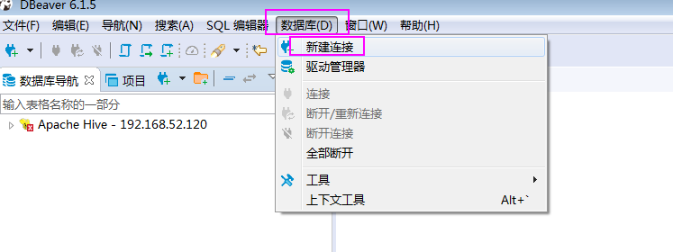
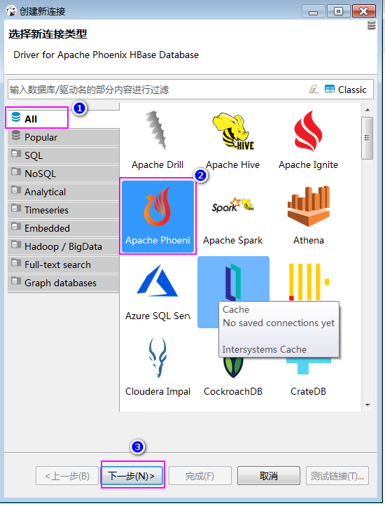

# Phoenix安装部署

- 需要先安装好hbase集群，phoenix只是一个工具，只需要在一台机器上安装就可以了，这里我们选择node02服务器来进行安装一台即可

# 1、下载安装包

* 从对应的地址下载：http://archive.apache.org/dist/phoenix/
* 这里我们使用的是
  * apache-phoenix-4.14.0-cdh5.14.2-bin.tar.gz

# 2、上传解压

- 将安装包上传到node02服务器的/kkb/soft路径下，然后进行解压

```shell
cd /kkb/soft/
tar -zxf apache-phoenix-4.14.0-cdh5.14.2-bin.tar.gz  -C /kkb/install/
```

# 3、修改配置

* 1、将phoenix目录下的==phoenix-4.8.2-HBase-1.2-server.jar==、

  ==phoenix-core-4.8.2-HBase-1.2.jar==拷贝到==各个 hbase的lib目录==下。

  node02执行以下命令，将两个jar包拷贝到hbase的lib目录下

  ```shell
  cd /kkb/install/apache-phoenix-4.14.0-cdh5.14.2-bin
  
  scp phoenix-4.14.0-cdh5.14.2-server.jar phoenix-core-4.14.0-cdh5.14.2.jar node01:/kkb/install/hbase-1.2.0-cdh5.14.2/lib/ 
  
  scp phoenix-4.14.0-cdh5.14.2-server.jar phoenix-core-4.14.0-cdh5.14.2.jar node02:/kkb/install/hbase-1.2.0-cdh5.14.2/lib/ 
  
  scp phoenix-4.14.0-cdh5.14.2-server.jar phoenix-core-4.14.0-cdh5.14.2.jar node03:/kkb/install/hbase-1.2.0-cdh5.14.2/lib/ 
  ```

  

* 2、 将hbase的配置文件==hbase-site.xml==、 hadoop下的配置文件==core-site.xml== 、==hdfs-site.xml==放到phoenix/bin/下，替换phoenix原来的配置文件。

  ```shell
  node02执行以下命令，进行拷贝配置文件
  
  cp /kkb/install/hadoop-2.6.0-cdh5.14.2/etc/hadoop/core-site.xml  /kkb/install/apache-phoenix-4.14.0-cdh5.14.2-bin/bin/
  
  cp /kkb/install/hadoop-2.6.0-cdh5.14.2/etc/hadoop/hdfs-site.xml  /kkb/install/apache-phoenix-4.14.0-cdh5.14.2-bin/bin/
  
  cp /kkb/install/hbase-1.2.0-cdh5.14.2/conf/hbase-site.xml  /kkb/install/apache-phoenix-4.14.0-cdh5.14.2-bin/bin/
  ```
  

  
* 3、重启hbase集群，使Phoenix的jar包生效。

  node01执行以下命令来重启hbase的集群

  ```shell
  cd /kkb/install/hbase-1.2.0-cdh5.14.2/
  bin/stop-hbase.sh 
  bin/start-hbase.sh 
  ```


# 4、验证是否成功

* 1、在phoenix/bin下输入命令, 进入到命令行，接下来就可以操作了

  ~~~shell
   node02执行以下命令，进入phoenix客户端
   
   cd /kkb/install/apache-phoenix-4.14.0-cdh5.14.2-bin/
   bin/sqlline.py node01:2181
  ~~~

# 5、Phoenix使用

## 1、 批处理方式

* 1、node02执行以下命令创建user_phoenix.sql文件
  * 内容如下

~~~sql
mkdir -p /kkb/install/phoenixsql
cd /kkb/install/phoenixsql/
vim user_phoenix.sql

create table if not exists user_phoenix (state varchar(10) NOT NULL,  city varchar(20) NOT NULL, population BIGINT  CONSTRAINT my_pk PRIMARY KEY (state, city));
~~~

* 2、node02执行以下命令，创建user_phoenix.csv数据文件

~~~shell
cd /kkb/install/phoenixsql/
vim user_phoenix.csv

NY,New York,8143197
CA,Los Angeles,3844829
IL,Chicago,2842518
TX,Houston,2016582
PA,Philadelphia,1463281
AZ,Phoenix,1461575
TX,San Antonio,1256509
CA,San Diego,1255540
TX,Dallas,1213825
CA,San Jose,912332
~~~

* 3、创建user_phoenix_query.sql文件

~~~sql
cd /kkb/install/phoenixsql
vim user_phoenix_query.sql

select state as "userState",count(city) as "City Count",sum(population) as "Population Sum" FROM user_phoenix GROUP BY state; 
~~~

* 4、执行sql语句

~~~sql
cd /kkb/install/phoenixsql

/kkb/install/apache-phoenix-4.14.0-cdh5.14.2-bin/bin/psql.py  node01:2181 user_phoenix.sql user_phoenix.csv  user_phoenix_query.sql
~~~


## 2、 命令行方式

* 执行命令

~~~shell
cd /kkb/install/apache-phoenix-4.14.0-cdh5.14.2-bin/
bin/sqlline.py node01:2181
~~~

* 退出命令行方式，phoenix的命令都需要一个感叹号

~~~
!quit
~~~

- 查看phoenix的帮助文档，显示所有命令

```
0: jdbc:phoenix:node01:2181> !help
!all                Execute the specified SQL against all the current
                    connections
!autocommit         Set autocommit mode on or off
!batch              Start or execute a batch of statements
!brief              Set verbose mode off
!call               Execute a callable statement
!close              Close the current connection to the database
!closeall           Close all current open connections
!columns            List all the columns for the specified table
!commit             Commit the current transaction (if autocommit is off)
!connect            Open a new connection to the database.
!dbinfo             Give metadata information about the database
!describe           Describe a table
!dropall            Drop all tables in the current database
!exportedkeys       List all the exported keys for the specified table
!go                 Select the current connection
!help               Print a summary of command usage
!history            Display the command history
!importedkeys       List all the imported keys for the specified table
!indexes            List all the indexes for the specified table
!isolation          Set the transaction isolation for this connection
!list               List the current connections
!manual             Display the SQLLine manual
!metadata           Obtain metadata information
!nativesql          Show the native SQL for the specified statement
!outputformat       Set the output format for displaying results
                    (table,vertical,csv,tsv,xmlattrs,xmlelements)
!primarykeys        List all the primary keys for the specified table
!procedures         List all the procedures
!properties         Connect to the database specified in the properties file(s)
!quit               Exits the program
!reconnect          Reconnect to the database
!record             Record all output to the specified file
!rehash             Fetch table and column names for command completion
!rollback           Roll back the current transaction (if autocommit is off)
!run                Run a script from the specified file
!save               Save the current variabes and aliases
!scan               Scan for installed JDBC drivers
!script             Start saving a script to a file
!set                Set a sqlline variable

Variable        Value      Description
=============== ========== ================================
autoCommit      true/false Enable/disable automatic
                           transaction commit
autoSave        true/false Automatically save preferences
color           true/false Control whether color is used
                           for display
fastConnect     true/false Skip building table/column list
                           for tab-completion
force           true/false Continue running script even
                           after errors
headerInterval  integer    The interval between which
                           headers are displayed
historyFile     path       File in which to save command
                           history. Default is
                           $HOME/.sqlline/history (UNIX,
                           Linux, Mac OS),
                           $HOME/sqlline/history (Windows)
incremental     true/false Do not receive all rows from
                           server before printing the first
                           row. Uses fewer resources,
                           especially for long-running
                           queries, but column widths may
                           be incorrect.
isolation       LEVEL      Set transaction isolation level
maxColumnWidth  integer    The maximum width to use when
                           displaying columns
maxHeight       integer    The maximum height of the
                           terminal
maxWidth        integer    The maximum width of the
                           terminal
numberFormat    pattern    Format numbers using
                           DecimalFormat pattern
outputFormat    table/vertical/csv/tsv Format mode for
                           result display
propertiesFile  path       File from which SqlLine reads
                           properties on startup; default is
                           $HOME/.sqlline/sqlline.properties
                           (UNIX, Linux, Mac OS),
                           $HOME/sqlline/sqlline.properties
                           (Windows)
rowLimit        integer    Maximum number of rows returned
                           from a query; zero means no
                           limit
showElapsedTime true/false Display execution time when
                           verbose
showHeader      true/false Show column names in query
                           results
showNestedErrs  true/false Display nested errors
showWarnings    true/false Display connection warnings
silent          true/false Be more silent
timeout         integer    Query timeout in seconds; less
                           than zero means no timeout
trimScripts     true/false Remove trailing spaces from
                           lines read from script files
verbose         true/false Show verbose error messages and
                           debug info
!sql                Execute a SQL command
!tables             List all the tables in the database
!typeinfo           Display the type map for the current connection
!verbose            Set verbose mode on
```


* 1、建立employee的映射表

  进入hbase客户端，创建一个普通表employee，并且有两个列族 company 和family
  node01执行以下以下命令进入hbase 的shell客户端
  
  ~~~ruby
  cd /kkb/install/hbase-1.2.0-cdh5.14.2/
  bin/hbase shell
  hbase(main):001:0> create 'employee','company','family'
  ~~~

* 2、数据准备

  ~~~ruby
  put 'employee','row1','company:name','ted'
  put 'employee','row1','company:position','worker'
  put 'employee','row1','family:tel','13600912345'
  put 'employee','row2','company:name','michael'
  put 'employee','row2','company:position','manager'
  put 'employee','row2','family:tel','1894225698'
  ~~~

* 3、建立hbase到phoenix的映射表

  node02进入到phoenix的客户端，然后创建映射表

  ~~~sql
  cd /kkb/install/apache-phoenix-4.14.0-cdh5.14.2-bin
  bin/sqlline.py node01:2181
  
  CREATE TABLE IF NOT EXISTS "employee" ("no" VARCHAR(10) NOT NULL PRIMARY KEY, "company"."name" VARCHAR(30),"company"."position" VARCHAR(20), "family"."tel" VARCHAR(20), "family"."age" INTEGER) column_encoded_bytes=0;
  ~~~

  > 说明
  >
  > 在建立映射表之前要说明的是，Phoenix是==大小写敏感==的，并且所有命令都是大写
  >
  > 如果你建的表名没有用双引号括起来，那么无论你输入的是大写还是小写，建立出来的表名都是大写的
  >
  > 如果你需要建立出同时包含大写和小写的表名和字段名，请把表名或者字段名用双引号括起来。 

  

* 4、查询映射表数据

~~~sql
0: jdbc:phoenix:node1:2181> select * from "employee";
+-------+----------+-----------+--------------+-------+
|  no   |   name   | position  |     tel      |  age  |
+-------+----------+-----------+--------------+-------+
| row1  | ted      | worker    | 13600912345  | null  |
| row2  | michael  | manager   | 1894225698   | null  |
+-------+----------+-----------+--------------+-------+

0: jdbc:phoenix:node01:2181> select * from "employee" where "tel" = '13600912345';
+-------+-------+-----------+--------------+-------+
|  no   | name  | position  |     tel      |  age  |
+-------+-------+-----------+--------------+-------+
| row1  | ted   | worker    | 13600912345  | null  |
+-------+-------+-----------+--------------+-------+
~~~

## 3、 GUI方式

- 通过dbeaver来连接phoenix

### 第一步：准备两个文件

- 我们通过dbeaver来连接phoenix需要两个文件，第一个文件是phoenix-4.14.0-cdh5.14.2-client.jar，第二个文件是hbase-site.xml

- 进入到phoenix的安装目录，获取第一个文件

  node02执行以下命令，进入到以下路径，获取第一个文件

```shell
cd /kkb/install/apache-phoenix-4.14.0-cdh5.14.2-bin
找到 phoenix-4.14.0-cdh5.14.2-client.jar  这个jar包，并将其下载下来备用

然后进入到node02服务器的hbase的安装配置文件路径，获取hbase-site.xml这个文件
cd /kkb/install/hbase-1.2.0-cdh5.14.2/conf/
找到hbase-site.xml，将其下载下来备用
```

### 第二步：将hbase-site.xml放到phoenix-4.14.0-cdh5.14.2-client.jar这个jar包里面去

- 我们在第一步找到了hbase-site.xml和phoenix-4.14.0-cdh5.14.2-client.jar 这两个文件之后，我们需要使用解压缩工具，将phoenix-4.14.0-cdh5.14.2-client.jar 这个jar包解压开，然后将hbase-site.xml放入到phoenix-4.14.0-cdh5.14.2-client.jar 这个jar包里面去


### 第三步：通过dbeaver去连接phoenix






- 注意：如果连接不上，可能不是操作配置的问题，有可能是因为dbeaver软件的问题，将dbeaver软件重启几次试试看

### 第四步：创建数据库表，并实现sql进行操作

- 直接在phoenix当中通过sql语句的方式来创建表并

```sql
CREATE TABLE IF NOT EXISTS US_POPULATION (
      state CHAR(2) NOT NULL,
      city VARCHAR NOT NULL,
      population BIGINT
      CONSTRAINT my_pk PRIMARY KEY (state, city));

UPSERT INTO US_POPULATION (state, city, population) values ('NY','New York',8143197);
UPSERT INTO US_POPULATION (state, city, population) values ('CA','Los Angeles',3844829);

SELECT * FROM US_POPULATION WHERE population > 8000000;
```

## 4、 JDBC调用方式

* 创建maven工程并导入jar包

~~~xml
<dependencies>
    <dependency>
        <groupId>org.apache.phoenix</groupId>
        <artifactId>phoenix-core</artifactId>
        <version>4.14.0-cdh5.14.2</version>
    </dependency>
    <dependency>
        <groupId>junit</groupId>
        <artifactId>junit</artifactId>
        <version>4.12</version>
    </dependency>
    <dependency>
        <groupId>org.testng</groupId>
        <artifactId>testng</artifactId>
        <version>6.14.3</version>
    </dependency>
    </dependencies>
    <build>
        <plugins>
            <!-- 限制jdk版本插件 -->
            <plugin>
                <groupId>org.apache.maven.plugins</groupId>
                <artifactId>maven-compiler-plugin</artifactId>
                <version>3.0</version>
                <configuration>
                    <source>1.8</source>
                    <target>1.8</target>
                    <encoding>UTF-8</encoding>
                </configuration>
            </plugin>
        </plugins>
    </build>
~~~

* 代码开发

~~~java
import org.testng.annotations.BeforeTest;
import org.testng.annotations.Test;
import java.sql.*;

public class PhoenixSearch {
    private Connection connection;
    private Statement statement;
    private ResultSet rs;
    
    @BeforeTest
    public void init() throws SQLException {
        //定义phoenix的连接url地址
        String url="jdbc:phoenix:node01:2181";
        connection = DriverManager.getConnection(url);
        //构建Statement对象
        statement = connection.createStatement();
    }
    @Test
    public void queryTable() throws SQLException {
        //定义查询的sql语句，注意大小写
        String sql="select * from US_POPULATION";
        //执行sql语句
        try {
            rs=statement.executeQuery(sql);
            while(rs.next()){
                System.out.println("state:"+rs.getString("state"));
                System.out.println("city:"+rs.getString("city"));
                System.out.println("population:"+rs.getInt("population"));
                System.out.println("-------------------------");
            }
        } catch (SQLException e) {
            e.printStackTrace();
        }finally {
            if(connection!=null){
                connection.close();
            }
        }
    }
}
~~~


