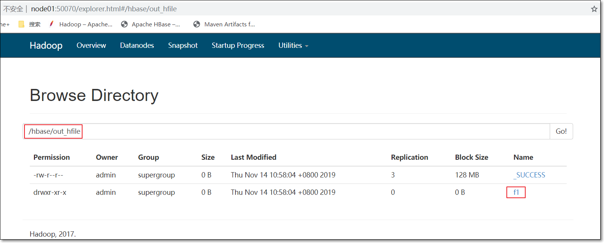
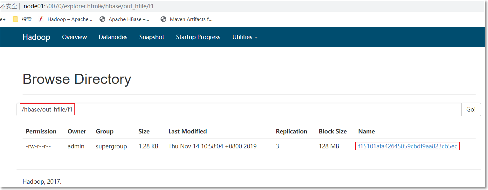
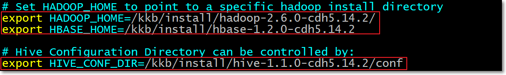

# 大数据数据库之HBase

# 一、课前准备

1. 安装好对应版本的HBase集群
2. 安装好3节点的hadoop集群
3. node03上安装好hive

# 二、课堂主题    

本堂课主要围绕HBase的实操知识点进行讲解。主要包括以下几个方面

1. HBase集成MapReduce
2. HBase集成hive
3. HBase表的rowkey设计
4. HBase表的热点

# 三、课堂目标

2. 掌握HBase集成MapReduce
3. 掌握HBase集成hive

4. 掌握HBase表的rowkey设计
5. 掌握HBase表的热点

# 四、知识要点

## 1. HBase集成MapReduce（重点 难点）

* HBase表中的数据最终都是存储在HDFS上，HBase天生的支持MR的操作，我们可以通过MR直接处理HBase表中的数据，并且MR可以将处理后的结果直接存储到HBase表中。
  * 参考地址：<http://hbase.apache.org/book.html#mapreduce>

### 1.1 实战一（30分钟）

* 需求：==读取HBase当中myuser这张表的f1:name、f1:age数据，将数据写入到另外一张myuser2表的f1列族里面去==

- 第一步：创建myuser2这张hbase表

  **注意：**列族的名字要与myuser表的列族名字相同

```ruby
hbase(main):010:0> create 'myuser2','f1'
```

- 第二步：创建maven工程并导入jar包

```xml
	<repositories>
        <repository>
            <id>cloudera</id>
            <url>https://repository.cloudera.com/artifactory/cloudera-repos/</url>
        </repository>
    </repositories>

    <dependencies>
        <dependency>
            <groupId>org.apache.hadoop</groupId>
            <artifactId>hadoop-client</artifactId>
            <version>2.6.0-mr1-cdh5.14.2</version>
        </dependency>
        <dependency>
            <groupId>org.apache.hbase</groupId>
            <artifactId>hbase-client</artifactId>
            <version>1.2.0-cdh5.14.2</version>
        </dependency>
        <dependency>
            <groupId>org.apache.hbase</groupId>
            <artifactId>hbase-server</artifactId>
            <version>1.2.0-cdh5.14.2</version>
        </dependency>
        <dependency>
            <groupId>junit</groupId>
            <artifactId>junit</artifactId>
            <version>4.12</version>
            <scope>test</scope>
        </dependency>
        <dependency>
            <groupId>org.testng</groupId>
            <artifactId>testng</artifactId>
            <version>6.14.3</version>
            <scope>test</scope>
        </dependency>
    </dependencies>
    <build>
        <plugins>
            <plugin>
                <groupId>org.apache.maven.plugins</groupId>
                <artifactId>maven-compiler-plugin</artifactId>
                <version>3.0</version>
                <configuration>
                    <source>1.8</source>
                    <target>1.8</target>
                    <encoding>UTF-8</encoding>
                    <!--    <verbal>true</verbal>-->
                </configuration>
            </plugin>
            <plugin>
                <groupId>org.apache.maven.plugins</groupId>
                <artifactId>maven-shade-plugin</artifactId>
                <version>2.2</version>
                <executions>
                    <execution>
                        <phase>package</phase>
                        <goals>
                            <goal>shade</goal>
                        </goals>
                        <configuration>
                            <filters>
                                <filter>
                                    <artifact>*:*</artifact>
                                    <excludes>
                                        <exclude>META-INF/*.SF</exclude>
                                        <exclude>META-INF/*.DSA</exclude>
                                        <exclude>META-INF/*/RSA</exclude>
                                    </excludes>
                                </filter>
                            </filters>
                        </configuration>
                    </execution>
                </executions>
            </plugin>
        </plugins>
    </build>
```

- 第三步：开发MR程序实现功能
- 自定义map类

```java
package com.kaikeba.hbase.demo01;

import org.apache.hadoop.hbase.Cell;
import org.apache.hadoop.hbase.CellUtil;
import org.apache.hadoop.hbase.client.Put;
import org.apache.hadoop.hbase.client.Result;
import org.apache.hadoop.hbase.io.ImmutableBytesWritable;
import org.apache.hadoop.hbase.mapreduce.TableMapper;
import org.apache.hadoop.hbase.util.Bytes;
import org.apache.hadoop.io.Text;

import java.io.IOException;

/**
 * myuser f1: name&age => myuser2 f1
 */
public class HBaseReadMapper extends TableMapper<Text, Put> {
    /**
     *
     * @param key rowkey
     * @param value rowkey此行的数据 Result类型
     * @param context
     * @throws IOException
     * @throws InterruptedException
     */
    @Override
    protected void map(ImmutableBytesWritable key, Result value, Context context) throws IOException, InterruptedException {
        //获得roweky的字节数组
        byte[] rowkey_bytes = key.get();
        String rowkeyStr = Bytes.toString(rowkey_bytes);
        Text text = new Text(rowkeyStr);

        //输出数据 -> 写数据 -> Put 构建Put对象
        Put put = new Put(rowkey_bytes);
        //获取一行中所有的Cell对象
        Cell[] cells = value.rawCells();
        //将f1 : name& age输出
        for(Cell cell: cells) {
            //当前cell是否是f1
            //列族
            byte[] family_bytes = CellUtil.cloneFamily(cell);
            String familyStr = Bytes.toString(family_bytes);
            if("f1".equals(familyStr)) {
                //在判断是否是name | age
                byte[] qualifier_bytes = CellUtil.cloneQualifier(cell);
                String qualifierStr = Bytes.toString(qualifier_bytes);
                if("name".equals(qualifierStr)) {
                    put.add(cell);
                }
                if("age".equals(qualifierStr)) {
                    put.add(cell);
                }
            }
        }

        //判断是否为空；不为空，才输出
        if(!put.isEmpty()){
            context.write(text, put);
        }
    }
}
```

- 自定义reduce类

```java
package com.kaikeba.hbase.demo01;

import org.apache.hadoop.hbase.client.Put;
import org.apache.hadoop.hbase.io.ImmutableBytesWritable;
import org.apache.hadoop.hbase.mapreduce.TableReducer;
import org.apache.hadoop.io.Text;
import java.io.IOException;

/**
 * TableReducer第三个泛型包含rowkey信息
 */
public class HBaseWriteReducer extends TableReducer<Text, Put, ImmutableBytesWritable> {
    //将map传输过来的数据，写入到hbase表
    @Override
    protected void reduce(Text key, Iterable<Put> values, Context context) throws IOException, InterruptedException {
        //rowkey
        ImmutableBytesWritable immutableBytesWritable = new ImmutableBytesWritable();
        immutableBytesWritable.set(key.toString().getBytes());

        //遍历put对象，并输出
        for(Put put: values) {
            context.write(immutableBytesWritable, put);
        }
    }
}
```

- main入口类

```java
package com.kaikeba.hbase.demo01;

import org.apache.hadoop.conf.Configuration;
import org.apache.hadoop.conf.Configured;
import org.apache.hadoop.hbase.HBaseConfiguration;
import org.apache.hadoop.hbase.TableName;
import org.apache.hadoop.hbase.client.Put;
import org.apache.hadoop.hbase.client.Scan;
import org.apache.hadoop.hbase.mapreduce.TableMapReduceUtil;
import org.apache.hadoop.io.Text;
import org.apache.hadoop.mapreduce.Job;
import org.apache.hadoop.util.Tool;
import org.apache.hadoop.util.ToolRunner;

public class HBaseMR extends Configured implements Tool {
    public static void main(String[] args) throws Exception {
        Configuration configuration = HBaseConfiguration.create();
        //设定绑定的zk集群
        configuration.set("hbase.zookeeper.quorum", "node01:2181,node02:2181,node03:2181");

        int run = ToolRunner.run(configuration, new HBaseMR(), args);
        System.exit(run);
    }

    @Override
    public int run(String[] args) throws Exception {
        Job job = Job.getInstance(super.getConf());
        job.setJarByClass(HBaseMR.class);

        //mapper
        TableMapReduceUtil.initTableMapperJob(TableName.valueOf("myuser"), new Scan(),HBaseReadMapper.class, Text.class, Put.class, job);
        //reducer
        TableMapReduceUtil.initTableReducerJob("myuser2", HBaseWriteReducer.class, job);

        boolean b = job.waitForCompletion(true);
        return b? 0: 1;
    }
}
```

* 本地运行或打成jar包提交到集群中运行

  ~~~shell
  hadoop jar hbase_day03-1.0-SNAPSHOT.jar com.kaikeba.hbase.demo01.HBaseMR
  ~~~


### 1.2 实战二（10分钟）

* 需求读取hdfs上面的数据，写入到hbase表里面去

  node03执行以下命令准备数据文件，并将数据文件上传到HDFS上面去

  在/kkb/install目录，创建user.txt文件


```shell
cd /kkb/install
vim user.txt
```

​		内容如下：

```
0007	zhangsan	18
0008	lisi	25
0009	wangwu	20
```

​		将文件上传到hdfs的路径下面去

```shell
hdfs dfs -mkdir -p /hbase/input
hdfs dfs -put /kkb/install/user.txt /hbase/input/
```

* 代码开发

 ~~~java
package com.kaikeba.hbase.demo02;

import org.apache.hadoop.conf.Configuration;
import org.apache.hadoop.fs.Path;
import org.apache.hadoop.hbase.HBaseConfiguration;
import org.apache.hadoop.hbase.client.Put;
import org.apache.hadoop.hbase.io.ImmutableBytesWritable;
import org.apache.hadoop.hbase.mapreduce.TableMapReduceUtil;
import org.apache.hadoop.hbase.mapreduce.TableReducer;
import org.apache.hadoop.hbase.util.Bytes;
import org.apache.hadoop.io.LongWritable;
import org.apache.hadoop.io.NullWritable;
import org.apache.hadoop.io.Text;
import org.apache.hadoop.mapreduce.Job;
import org.apache.hadoop.mapreduce.Mapper;
import org.apache.hadoop.mapreduce.lib.input.FileInputFormat;

import java.io.IOException;

/**
 * 将HDFS上文件/hbase/input/user.txt数据，导入到HBase的myuser2表
 */
public class HDFS2HBase {
    public static class HdfsMapper extends Mapper<LongWritable,Text, Text, NullWritable> {

        //数据原样输出
        protected void map(LongWritable key, Text value, Context context) throws IOException, InterruptedException {
            context.write(value,NullWritable.get());
        }
    }

    public static class HBASEReducer extends TableReducer<Text,NullWritable, ImmutableBytesWritable> {

        protected void reduce(Text key, Iterable<NullWritable> values, Context context) throws IOException, InterruptedException {
            /**
             * key -> 一行数据
             * 样例数据：
             * 0007	zhangsan	18
             * 0008	lisi	25
             * 0009	wangwu	20
             */
            String[] split = key.toString().split("\t");

            Put put = new Put(Bytes.toBytes(split[0]));
            put.addColumn("f1".getBytes(),"name".getBytes(),split[1].getBytes());
            put.addColumn("f1".getBytes(),"age".getBytes(), split[2].getBytes());

            context.write(new ImmutableBytesWritable(Bytes.toBytes(split[0])), put);
        }
    }

    public static void main(String[] args) throws IOException, ClassNotFoundException, InterruptedException {
        Configuration conf = HBaseConfiguration.create();
        //设定zk集群
        conf.set("hbase.zookeeper.quorum", "node01:2181,node02:2181,node03:2181");
        Job job = Job.getInstance(conf);

        job.setJarByClass(HDFS2HBase.class);

        //可省略
        //job.setInputFormatClass(TextInputFormat.class);
        //输入文件路径
        FileInputFormat.addInputPath(job ,new Path("hdfs://node01:8020/hbase/input"));

        job.setMapperClass(HdfsMapper.class);
        //map端的输出的key value 类型
        job.setMapOutputKeyClass(Text.class);
        job.setMapOutputValueClass(NullWritable.class);

        //指定输出到hbase的表名
        TableMapReduceUtil.initTableReducerJob("myuser2",HBASEReducer.class,job);

        //设置reduce个数
        job.setNumReduceTasks(1);

        System.exit(job.waitForCompletion(true)?0:1);
    }
}
 ~~~

* 打成jar包提交到集群中运行

~~~shell
hadoop jar hbase_day03-1.0-SNAPSHOT.jar com.kaikeba.hbase.demo02.HDFS2HBase
~~~


### 1.3 实战三（30分钟）

* 需求

  * ==通过bulkload的方式批量加载数据到HBase表中==
  * ==将我们hdfs上面的这个路径/hbase/input/user.txt的数据文件，转换成HFile格式，然后load到myuser2这张表里面去==

* 知识点描述

  - 加载数据到HBase当中去的方式多种多样，我们可以使用HBase的javaAPI或者使用sqoop将我们的数据写入或者导入到HBase当中去，但是这些方式不是慢就是在导入的过程的占用Region资源导致效率低下
  - 我们也可以通过MR的程序，将我们的数据直接转换成HBase的最终存储格式HFile，然后直接load数据到HBase当中去即可
  
* HBase数据正常写流程回顾

  

* bulkload方式的处理示意图


* 好处

  - 导入过程不占用Region资源
  - 能快速导入海量的数据
  - 节省内存
  
* ==1、开发生成HFile文件的代码==

- 自定义map类

```java
package com.kaikeba.hbase.demo03;

import org.apache.hadoop.hbase.client.Put;
import org.apache.hadoop.hbase.io.ImmutableBytesWritable;
import org.apache.hadoop.io.LongWritable;
import org.apache.hadoop.io.Text;
import org.apache.hadoop.mapreduce.Mapper;

import java.io.IOException;

//四个泛型中后两个，分别对应rowkey及put
public class BulkLoadMapper extends Mapper<LongWritable, Text, ImmutableBytesWritable, Put> {
    @Override
    protected void map(LongWritable key, Text value, Context context) throws IOException, InterruptedException {
        String[] split = value.toString().split("\t");
        //封装输出的rowkey类型
        ImmutableBytesWritable immutableBytesWritable = new ImmutableBytesWritable(split[0].getBytes());

        //构建put对象
        Put put = new Put(split[0].getBytes());
        put.addColumn("f1".getBytes(), "name".getBytes(), split[1].getBytes());
        put.addColumn("f1".getBytes(), "age".getBytes(), split[2].getBytes());

        context.write(immutableBytesWritable, put);
    }
}
```

- 程序main

```java
package com.kaikeba.hbase.demo03;

import org.apache.hadoop.conf.Configuration;
import org.apache.hadoop.conf.Configured;
import org.apache.hadoop.fs.Path;
import org.apache.hadoop.hbase.HBaseConfiguration;
import org.apache.hadoop.hbase.TableName;
import org.apache.hadoop.hbase.client.Connection;
import org.apache.hadoop.hbase.client.ConnectionFactory;
import org.apache.hadoop.hbase.client.Put;
import org.apache.hadoop.hbase.client.Table;
import org.apache.hadoop.hbase.io.ImmutableBytesWritable;
import org.apache.hadoop.hbase.mapreduce.HFileOutputFormat2;
import org.apache.hadoop.mapreduce.Job;
import org.apache.hadoop.mapreduce.lib.input.FileInputFormat;
import org.apache.hadoop.util.Tool;
import org.apache.hadoop.util.ToolRunner;

public class HBaseBulkLoad extends Configured implements Tool {
    public static void main(String[] args) throws Exception {
        Configuration configuration = HBaseConfiguration.create();
        //设定zk集群
        configuration.set("hbase.zookeeper.quorum", "node01:2181,node02:2181,node03:2181");

        int run = ToolRunner.run(configuration, new HBaseBulkLoad(), args);
        System.exit(run);
    }
    @Override
    public int run(String[] args) throws Exception {
        Configuration conf = super.getConf();
        Job job = Job.getInstance(conf);
        job.setJarByClass(HBaseBulkLoad.class);

        FileInputFormat.addInputPath(job, new Path("hdfs://node01:8020/hbase/input"));
        job.setMapperClass(BulkLoadMapper.class);
        job.setMapOutputKeyClass(ImmutableBytesWritable.class);
        job.setMapOutputValueClass(Put.class);

        Connection connection = ConnectionFactory.createConnection(conf);
        Table table = connection.getTable(TableName.valueOf("myuser2"));

        //使MR可以向myuser2表中，增量增加数据
        HFileOutputFormat2.configureIncrementalLoad(job, table, connection.getRegionLocator(TableName.valueOf("myuser2")));
        //数据写回到HDFS，写成HFile -> 所以指定输出格式为HFileOutputFormat2
        job.setOutputFormatClass(HFileOutputFormat2.class);
        HFileOutputFormat2.setOutputPath(job, new Path("hdfs://node01:8020/hbase/out_hfile"));

        //开始执行
        boolean b = job.waitForCompletion(true);

        return b? 0: 1;
    }
}
```

* ==2、打成jar包提交到集群中运行==

~~~shell
hadoop jar hbase_day03-1.0-SNAPSHOT.jar com.kaikeba.hbase.demo03.HBaseBulkLoad
~~~

* ==3、观察HDFS上输出的结果==





* ==4、加载HFile文件到hbase表中==

  * 方式一：代码加载

  ~~~java
  package com.kaikeba.hbase.demo03;
  
  import org.apache.hadoop.conf.Configuration;
  import org.apache.hadoop.fs.Path;
  import org.apache.hadoop.hbase.HBaseConfiguration;
  import org.apache.hadoop.hbase.TableName;
  import org.apache.hadoop.hbase.client.Admin;
  import org.apache.hadoop.hbase.client.Connection;
  import org.apache.hadoop.hbase.client.ConnectionFactory;
  import org.apache.hadoop.hbase.client.Table;
  import org.apache.hadoop.hbase.mapreduce.LoadIncrementalHFiles;
  
  public class LoadData {
      public static void main(String[] args) throws Exception {
          Configuration configuration = HBaseConfiguration.create();
          configuration.set("hbase.zookeeper.quorum", "node01,node02,node03");
          //获取数据库连接
          Connection connection =  ConnectionFactory.createConnection(configuration);
          //获取表的管理器对象
          Admin admin = connection.getAdmin();
          //获取table对象
          TableName tableName = TableName.valueOf("myuser2");
          Table table = connection.getTable(tableName);
          //构建LoadIncrementalHFiles加载HFile文件
          LoadIncrementalHFiles load = new LoadIncrementalHFiles(configuration);
          load.doBulkLoad(new Path("hdfs://node01:8020/hbase/out_hfile"), admin,table,connection.getRegionLocator(tableName));
      }
  }
  ~~~

  * 方式二：命令加载

    先将hbase的jar包添加到hadoop的classpath路径下
  
  ```shell
  export HBASE_HOME=/kkb/install/hbase-1.2.0-cdh5.14.2/
  export HADOOP_HOME=/kkb/install/hadoop-2.6.0-cdh5.14.2/
  export HADOOP_CLASSPATH=`${HBASE_HOME}/bin/hbase mapredcp`
  ```
  
  * 运行命令
  
  ```shell
  yarn jar /kkb/install/hbase-1.2.0-cdh5.14.2/lib/hbase-server-1.2.0-cdh5.14.2.jar   completebulkload /hbase/out_hfile myuser2
  ```

​	

## 2. HBase集成Hive（重点）

- Hive提供了与HBase的集成，使得能够在HBase表上使用hive sql 语句进行查询、插入操作以及进行Join和Union等复杂查询，同时也可以将hive表中的数据映射到Hbase中

### 2.1 HBase与Hive的对比（20分钟）

#### 2.1.1 Hive

- 数据仓库

  Hive的本质其实就相当于将HDFS中已经存储的文件在Mysql中做了一个双射关系，以方便使用HQL去管理查询。

- 用于数据分析、清洗                

  Hive适用于离线的数据分析和清洗，延迟较高

- 基于HDFS、MapReduce

  Hive存储的数据依旧在DataNode上，编写的HQL语句终将是转换为MapReduce代码执行。（不要钻不需要执行MapReduce代码的情况的牛角尖）

#### 2.1.2 HBase

- 数据库

  是一种面向列存储的非关系型数据库。

- 用于存储结构化和非结构话的数据

  适用于单表非关系型数据的存储，不适合做关联查询，类似JOIN等操作。

- 基于HDFS

  数据持久化存储的体现形式是Hfile，存放于DataNode中，被ResionServer以region的形式进行管理。

- 延迟较低，接入在线业务使用

  面对大量的企业数据，HBase可以直线单表大量数据的存储，同时提供了高效的数据访问速度。

##### 2.1.3 总结：Hive与HBase

- Hive和Hbase是两种基于Hadoop的不同技术，Hive是一种类SQL的引擎，并且运行MapReduce任务，Hbase是一种在Hadoop之上的NoSQL 的Key/vale数据库。这两种工具是可以同时使用的。就像用Google来搜索，用FaceBook进行社交一样，Hive可以用来进行统计查询，HBase可以用来进行实时查询，数据也可以从Hive写到HBase，或者从HBase写回Hive。

### 2.2 整合配置

#### 2.2.1 拷贝jar包

- 将我们HBase的五个jar包拷贝到hive的lib目录下

- hbase的jar包都在/kkb/install/hbase-1.2.0-cdh5.14.2/lib

- 我们需要拷贝五个jar包名字如下

```
hbase-client-1.2.0-cdh5.14.2.jar                  
hbase-hadoop2-compat-1.2.0-cdh5.14.2.jar 
hbase-hadoop-compat-1.2.0-cdh5.14.2.jar  
hbase-it-1.2.0-cdh5.14.2.jar    
hbase-server-1.2.0-cdh5.14.2.jar
```

- 我们直接在node03执行以下命令，通过创建软连接的方式来进行jar包的依赖

```shell
ln -s /kkb/install/hbase-1.2.0-cdh5.14.2/lib/hbase-client-1.2.0-cdh5.14.2.jar              /kkb/install/hive-1.1.0-cdh5.14.2/lib/hbase-client-1.2.0-cdh5.14.2.jar   

ln -s /kkb/install/hbase-1.2.0-cdh5.14.2/lib/hbase-hadoop2-compat-1.2.0-cdh5.14.2.jar      /kkb/install/hive-1.1.0-cdh5.14.2/lib/hbase-hadoop2-compat-1.2.0-cdh5.14.2.jar             
ln -s /kkb/install/hbase-1.2.0-cdh5.14.2/lib/hbase-hadoop-compat-1.2.0-cdh5.14.2.jar       /kkb/install/hive-1.1.0-cdh5.14.2/lib/hbase-hadoop-compat-1.2.0-cdh5.14.2.jar            
ln -s /kkb/install/hbase-1.2.0-cdh5.14.2/lib/hbase-it-1.2.0-cdh5.14.2.jar     /kkb/install/hive-1.1.0-cdh5.14.2/lib/hbase-it-1.2.0-cdh5.14.2.jar    

ln -s /kkb/install/hbase-1.2.0-cdh5.14.2/lib/hbase-server-1.2.0-cdh5.14.2.jar          /kkb/install/hive-1.1.0-cdh5.14.2/lib/hbase-server-1.2.0-cdh5.14.2.jar  
```

#### 2.2.2 修改hive的配置文件

- 编辑**node03**服务器上面的hive的配置文件hive-site.xml

```shell
cd /kkb/install/hive-1.1.0-cdh5.14.2/conf
vim hive-site.xml
```

-  添加以下两个属性的配置

```xml
	<property>
		<name>hive.zookeeper.quorum</name>
		<value>node01,node02,node03</value>
	</property>
	<property>
		<name>hbase.zookeeper.quorum</name>
		<value>node01,node02,node03</value>
	</property>
```

#### 2.2.3 修改hive-env.sh配置文件

```shell
cd /kkb/install/hive-1.1.0-cdh5.14.2/conf
vim hive-env.sh
```

- 添加以下配置

```shell
export HADOOP_HOME=/kkb/install/hadoop-2.6.0-cdh5.14.2/
export HBASE_HOME=/kkb/install/servers/hbase-1.2.0-cdh5.14.2
export HIVE_CONF_DIR=/kkb/install/hive-1.1.0-cdh5.14.2/conf
```



### 2.3 需求一：将hive表当中分析的结果保存到hbase表当中去

#### 2.3.1 hive当中建表

- node03执行以下命令，进入hive客户端，并创建hive表

```shell
cd /kkb/install/hive-1.1.0-cdh5.14.2/
bin/hive
```

- 创建hive数据库与hive对应的数据库表

```mysql
create database course;
use course;

create external table if not exists course.score(id int, cname string, score int) 
row format delimited fields terminated by '\t' stored as textfile ;
```

#### 2.3.2 准备数据内容如下并加载到hive表

- node03执行以下命令，创建数据文件

```shell
cd /kkb/install/
mkdir hivedatas

cd /kkb/install/hivedatas
vim hive-hbase.txt
```

- 文件内容如下

```
1	zhangsan	80
2	lisi	60
3	wangwu	30
4	zhaoliu	70
```

- 进入hive客户端进行加载数据

```mysql
hive (course)> load data local inpath '/kkb/install/hivedatas/hive-hbase.txt' into table score;
hive (course)> select * from score;
```

#### 2.3.3 创建hive管理表与HBase进行映射

- 我们可以创建一个hive的管理表与hbase当中的表进行映射，hive管理表当中的数据，都会存储到hbase上面去

- hive当中创建内部表

```sql
create table course.hbase_score(id int,cname string,score int) 
stored by 'org.apache.hadoop.hive.hbase.HBaseStorageHandler'  
with serdeproperties("hbase.columns.mapping" = "cf:name,cf:score") tblproperties("hbase.table.name" = "hbase_score");
```

- 通过insert  overwrite select  插入数据

```mysql
insert overwrite table course.hbase_score select id,cname,score from course.score;
```

#### 2.3.4 hbase当中查看表hbase_score

- 进入hbase的客户端查看表hbase_score，并查看当中的数据

```ruby
hbase(main):023:0> list

TABLE                                                                                 hbase_score                                                                           myuser                                                                                 myuser2                                                                               student                                                                               user                                                                                   5 row(s) in 0.0210 seconds
=> ["hbase_score", "myuser", "myuser2", "student", "user"]

hbase(main):024:0> scan 'hbase_score'

ROW                      COLUMN+CELL                                                   
 1                       column=cf:name, timestamp=1550628395266, value=zhangsan       
 1                       column=cf:score, timestamp=1550628395266, value=80           
 2                       column=cf:name, timestamp=1550628395266, value=lisi           
 2                       column=cf:score, timestamp=1550628395266, value=60           
 3                       column=cf:name, timestamp=1550628395266, value=wangwu         
 3                       column=cf:score, timestamp=1550628395266, value=30           
 4                       column=cf:name, timestamp=1550628395266, value=zhaoliu       
 4                       column=cf:score, timestamp=1550628395266, value=70           
4 row(s) in 0.0360 seconds
```

### 2.4 需求二：创建hive外部表，映射HBase当中已有的表模型（5分钟）

#### 2.4.1 HBase当中创建表并手动插入加载一些数据

- 进入HBase的shell客户端，

```shell
bin/hbase shell
```

- 手动创建一张表，并插入加载一些数据进去

```ruby
# 创建一张表
create 'hbase_hive_score',{ NAME =>'cf'}
# 通过put插入数据到hbase表
put 'hbase_hive_score','1','cf:name','zhangsan'
put 'hbase_hive_score','1','cf:score', '95'
put 'hbase_hive_score','2','cf:name','lisi'
put 'hbase_hive_score','2','cf:score', '96'
put 'hbase_hive_score','3','cf:name','wangwu'
put 'hbase_hive_score','3','cf:score', '97'
```

#### 2.4.2 建立hive的外部表，映射HBase当中的表以及字段

- 在hive当中建立外部表

- 进入hive客户端，然后执行以下命令进行创建hive外部表，就可以实现映射HBase当中的表数据

```mysql
CREATE external TABLE course.hbase2hive(id int, name string, score int) 
STORED BY 'org.apache.hadoop.hive.hbase.HBaseStorageHandler' 
WITH SERDEPROPERTIES ("hbase.columns.mapping" = ":key,cf:name,cf:score") TBLPROPERTIES("hbase.table.name" ="hbase_hive_score");
```

- 查看hive表course.hbase2hive

```mysql
select * from course.hbase2hive;
```

## 3. HBase表的rowkey设计（重点 30分钟）

- rowkey设计三原则

### 3.1 rowkey长度原则

- rowkey是一个二进制码流，可以是任意字符串，最大长度64kb，实际应用中一般为10-100bytes，以byte[]形式保存，一般设计成定长。

* 建议尽可能短；但是也不能太短，否则rowkey前缀重复的概率增大
* 设计过长会降低memstore内存的利用率和HFile存储数据的效率。

### 3.2 rowkey散列原则

- 建议将rowkey的高位作为**散列字段**，这样将提高数据均衡分布在每个RegionServer，以实现负载均衡的几率。
- 如果没有散列字段，首字段直接是时间信息。所有的数据都会集中在一个RegionServer上，这样在数据检索的时候负载会集中在个别的RegionServer上，造成热点问题，会降低查询效率。	

### 3.3 rowkey唯一原则

- 必须在设计上保证其唯一性，rowkey是按照字典顺序排序存储的
- 因此，设计rowkey的时候，要充分利用这个排序的特点，可以将经常读取的数据存储到一块，将最近可能会被访问的数据放到一块
- 下图为电信上网详单数据，保存在HBase的一个应用场景


## 4. HBase表的热点（重点）

### 4.1 什么是热点

- 检索habse的记录首先要通过row key来定位数据行。
- 当大量的client访问hbase集群的一个或少数几个节点，造成少数region server的读/写请求过多、负载过大，而其他region server负载却很小，就造成了“热点”现象。

### 4.2 热点的解决方案

#### 4.2.1 预分区

- 预分区的目的让表的数据可以均衡的分散在集群中，而不是默认只有一个region分布在集群的一个节点上。

#### 4.2.2 加盐             

- 这里所说的加盐不是密码学中的加盐，而是在rowkey的前面增加随机数，具体就是给rowkey分配一个随机前缀以使得它和之前的rowkey的开头不同

#### 4.2.3 哈希

- 哈希会使同一行永远用一个前缀加盐。哈希也可以使负载分散到整个集群，但是读却是可以预测的。使用确定的哈希可以让客户端重构完整的rowkey，可以使用get操作准确获取某一个行数据。

~~~
rowkey=MD5(username).subString(0,10)+时间戳	
~~~

#### 4.2.4 反转

- 反转固定长度或者数字格式的rowkey。这样可以使得rowkey中经常改变的部分（最没有意义的部分）放在前面。
- 这样可以有效的随机rowkey，但是牺牲了rowkey的有序性。

~~~
电信公司：
移动-----------> 136xxxx9301  ----->1039xxxx631
				136xxxx1234  
				136xxxx2341 
电信
联通

user表
rowkey    name    age   sex    address
		  lisi1    21     m       beijing
		  lisi2    22     m       beijing
		  lisi3    25     m       beijing
		  lisi4    30     m       beijing
		  lisi5    40     f       shanghai
		  lisi6    50     f       tianjin
	          
需求：后期想经常按照居住地和年龄进行查询？	
rowkey= address+age+随机数
        beijing21+随机数
        beijing22+随机数
        beijing25+随机数
        beijing30+随机数
   
rowkey= address+age+随机数
~~~

