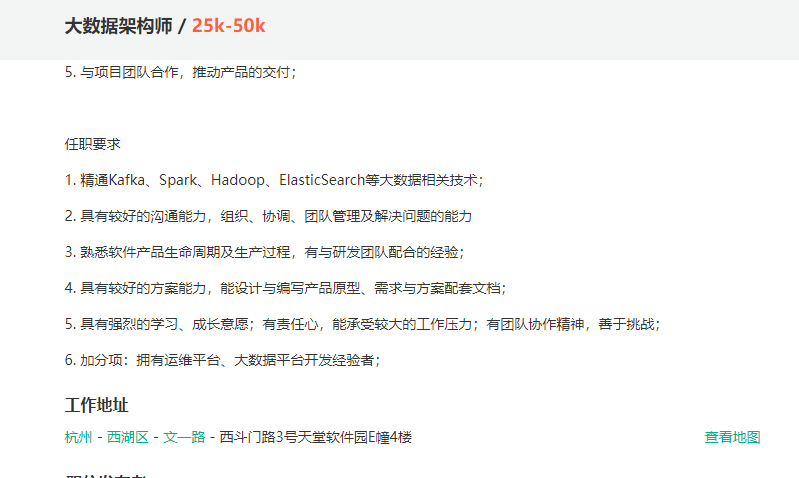
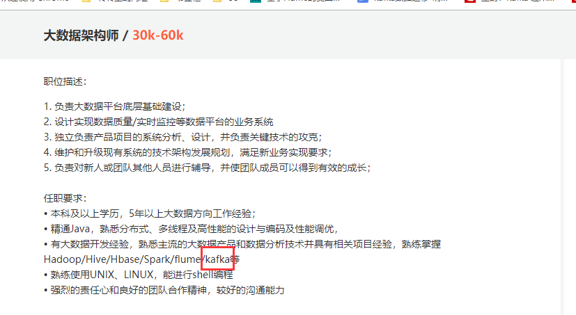

# 深入浅出Kafka-第一天

## 一 、课前准备

准备好对应的服务器，方便后面搭建kafka集群

准备好zk集群，后面kafka集群安装部署需要依赖于zk集群

## 二 、课堂主题

本课程主要讲解Kafka的基础知识，主要包括kafka集群架构、kafka集群安装部署、kafka命令行操作、kafka生产者和消费者代码等知识点

## 三 、课程目标

1. 了解为什么有消息系统
2. 掌握Kafka的架构原理
3. 掌握kafka的集群安装
4. 掌握kafka命令行操作
5. 掌握kafka生产者和消费者代码开发


## 四 、知识要点

### 1. Kafka概述

#### 1.1 为什么有消息系统

**解耦**
允许你独立的扩展或修改两边的处理过程，只要确保它们遵守同样的接口约束。

**冗余**
消息队列把数据进行持久化直到它们已经被完全处理，通过这一方式规避了数据丢失风险。许多消息队列所采用的"插入-获取-删除"范式中，在把一个消息从队列中删除之前，需要你的处理系统明确的指出该消息已经被处理完毕，从而确保你的数据被安全的保存直到你使用完毕。

**扩展性**
因为消息队列解耦了你的处理过程，所以增大消息入队和处理的频率是很容易的，只要另外增加处理过程即可。

**灵活性 & 峰值处理能力**
在访问量剧增的情况下，应用仍然需要继续发挥作用，但是这样的突发流量并不常见。如果为以能处理这类峰值访问为标准来投入资源随时待命无疑是巨大的浪费。使用消息队列能够使关键组件顶住突发的访问压力，而不会因为突发的超负荷的请求而完全崩溃。

**可恢复性**
系统的一部分组件失效时，不会影响到整个系统。消息队列降低了进程间的耦合度，所以即使一个处理消息的进程挂掉，加入队列中的消息仍然可以在系统恢复后被处理。

**顺序保证**
在大多使用场景下，数据处理的顺序都很重要。大部分消息队列本来就是排序的，并且能保证数据会按照特定的顺序来处理。（Kafka 保证一个 Partition 内的消息的有序性）

**缓冲**
有助于控制和优化数据流经过系统的速度，解决生产消息和消费消息的处理速度不一致的情况。

**异步通信**
很多时候，用户不想也不需要立即处理消息。消息队列提供了异步处理机制，允许用户把一个消息放入队列，但并不立即处理它。想向队列中放入多少消息就放多少，然后在需要的时候再去处理它们。

#### 1.2 Kafka核心概念

~~~
	Kafka是最初由Linkedin公司开发，是一个分布式、分区的、多副本的、多订阅者，基于zookeeper协调的分布式日志系统（也可以当做MQ系统），常见可以用于web/nginx日志、访问日志，消息服务等等，Linkedin于2010年贡献给了Apache基金会并成为顶级开源项目。
	
	kafka是一个分布式消息队列。具有高性能、持久化、多副本备份、横向扩展能力。生产者往队列里写消息，消费者从队列里取消息进行业务逻辑。Kafka就是一种发布-订阅模式。将消息保存在磁盘中，以顺序读写方式访问磁盘，避免随机读写导致性能瓶颈。

~~~


#### 1.3 kafka特性

- `高吞吐、低延迟`

  ~~~
  kakfa 最大的特点就是收发消息非常快，kafka 每秒可以处理几十万条消息，它的最低延迟只有几毫秒。
  ~~~

- `高伸缩性`

  ~~~
   每个主题(topic) 包含多个分区(partition)，主题中的分区可以分布在不同的主机(broker)中。
  ~~~

- `持久性、可靠性`

  ~~~
  Kafka 能够允许数据的持久化存储，消息被持久化到磁盘，并支持数据备份防止数据丢失。
  ~~~

- `容错性`

  ~~~
   允许集群中的节点失败，某个节点宕机，Kafka 集群能够正常工作。
  ~~~

- `高并发`

  ~~~
  支持数千个客户端同时读写。
  ~~~


#### 1.4 Kafka集群架构


* producer

  ~~~
   消息生产者，发布消息到Kafka集群的终端或服务
  ~~~

* broker

  ~~~
  Kafka集群中包含的服务器，一个borker就表示kafka集群中的一个节点
  ~~~

* topic

  ~~~
  每条发布到Kafka集群的消息属于的类别，即Kafka是面向 topic 的。
  更通俗的说Topic就像一个消息队列，生产者可以向其写入消息，消费者可以从中读取消息，一个Topic支持多个生产者或消费者同时订阅它，所以其扩展性很好。
  ~~~

*  partition

  ~~~
  每个 topic 包含一个或多个partition。Kafka分配的单位是partition
  ~~~

* replica

  ~~~
  partition的副本，保障 partition 的高可用。
  ~~~

* consumer

  ~~~
  从Kafka集群中消费消息的终端或服务
  ~~~

* consumer group

  ~~~
  每个 consumer 都属于一个 consumer group，每条消息只能被 consumer group 中的一个 Consumer 消费，但可以被多个 consumer group 消费。
  ~~~

* leader

  ~~~
  每个partition有多个副本，其中有且仅有一个作为Leader，Leader是当前负责数据的读写的partition。 producer 和 consumer 只跟 leader 交互
  ~~~

* follower

  ~~~
  Follower跟随Leader，所有写请求都通过Leader路由，数据变更会广播给所有Follower，Follower与Leader保持数据同步。如果Leader失效，则从Follower中选举出一个新的Leader。
  ~~~


* controller

     ~~~
     	知道大家有没有思考过一个问题，就是Kafka集群中某个broker宕机之后，是谁负责感知到他的宕机，以及负责进行Leader Partition的选举？如果你在Kafka集群里新加入了一些机器，此时谁来负责把集群里的数据进行负载均衡的迁移？包括你的Kafka集群的各种元数据，比如说每台机器上有哪些partition，谁是leader，谁是follower，是谁来管理的？如果你要删除一个topic，那么背后的各种partition如何删除，是谁来控制？还有就是比如Kafka集群扩容加入一个新的broker，是谁负责监听这个broker的加入？如果某个broker崩溃了，是谁负责监听这个broker崩溃？这里就需要一个Kafka集群的总控组件，Controller。他负责管理整个Kafka集群范围内的各种东西。
     
     ~~~

* zookeeper

     ~~~
     (1)	Kafka 通过 zookeeper 来存储集群的meta元数据信息
     (2)一旦controller所在broker宕机了，此时临时节点消失，集群里其他broker会一直监听这个临时节点，发现临时节点消失了，就争抢再次创建临时节点，保证有一台新的broker会成为controller角色。
     ~~~

* offset

  * 偏移量

  ~~~
  消费者在对应分区上已经消费的消息数（位置），offset保存的地方跟kafka版本有一定的关系。
  kafka0.8 版本之前offset保存在zookeeper上。
  kafka0.8 版本之后offset保存在kafka集群上。
  	它是把消费者消费topic的位置通过kafka集群内部有一个默认的topic，
  	名称叫 __consumer_offsets，它默认有50个分区。
  ~~~

* ISR机制

  ~~~
  	光是依靠多副本机制能保证Kafka的高可用性，但是能保证数据不丢失吗？不行，因为如果leader宕机，但是leader的数据还没同步到follower上去，此时即使选举了follower作为新的leader，当时刚才的数据已经丢失了。
  
  	ISR是：in-sync replica，就是跟leader partition保持同步的follower partition的数量，只有处于ISR列表中的follower才可以在leader宕机之后被选举为新的leader，因为在这个ISR列表里代表他的数据跟leader是同步的。
  ~~~


### 2. kafka集群安装部署

- 1、下载安装包（http://kafka.apache.org）

  ~~~
  kafka_2.11-1.0.1.tgz
  ~~~

- 2、规划安装目录

  ~~~
  /kkb/install
  ~~~

- 3、上传安装包到服务器中

  ~~~
  通过FTP工具上传安装包到node01服务器上
  ~~~

- 4、解压安装包到指定规划目录

  ~~~shell
  tar -zxvf kafka_2.11-1.0.1.tgz -C /kkb/install
  ~~~

- 5、重命名解压目录

  ~~~shell
  mv kafka_2.11-1.0.1 kafka
  ~~~

- 6、修改配置文件

  - 在node01上修改

    - 进入到kafka安装目录下有一个config目录

      - vi server.properties

        ```shell
        #指定kafka对应的broker id ，唯一
        broker.id=0
        #指定数据存放的目录
        log.dirs=/kkb/install/kafka/kafka-logs
        #指定zk地址
        zookeeper.connect=node01:2181,node02:2181,node03:2181
        #指定是否可以删除topic ,默认是false 表示不可以删除
        delete.topic.enable=true
        #指定broker主机名
        host.name=node01
        ```

    - 配置kafka环境变量

      - sudo vi /etc/profile

        ```
        export KAFKA_HOME=/kkb/install/kafka
        export PATH=$PATH:$KAFKA_HOME/bin
        ```

- 6、分发kafka安装目录到其他节点

  ```
  scp -r kafka node02:/kkb/install
  scp -r kafka node03:/kkb/install
  scp /etc/profile node02:/etc
  scp /etc/profile node03:/etc
  ```

- 7、修改node02和node03上的配置

  - node02

    - vi server.properties

      ```shell
      #指定kafka对应的broker id ，唯一
      broker.id=1
      #指定数据存放的目录
      log.dirs=/kkb/install/kafka/kafka-logs
      #指定zk地址
      zookeeper.connect=node01:2181,node02:2181,node03:2181
      #指定是否可以删除topic ,默认是false 表示不可以删除
      delete.topic.enable=true
      #指定broker主机名
      host.name=node02
      ```

  - node03

    - vi server.properties

      ```shell
      #指定kafka对应的broker id ，唯一
      broker.id=2
      #指定数据存放的目录
      log.dirs=/kkb/install/kafka/kafka-logs
      #指定zk地址
      zookeeper.connect=node01:2181,node02:2181,node03:2181
      #指定是否可以删除topic ,默认是false 表示不可以删除
      delete.topic.enable=true
      #指定broker主机名
      host.name=node03
      ```


### 3. kafka集群启动和停止

#### 3.1 启动

- 先启动zk集群

- 然后在所有节点执行脚本

  ```shell
  nohup kafka-server-start.sh /kkb/install/kafka/config/server.properties >/dev/null 2>&1 &
  ```

- 一键启动kafka

  - start_kafka.sh

    ```shell
    #!/bin/sh
    for host in node01 node02 node03
    do
            ssh $host "source /etc/profile;nohup kafka-server-start.sh /kkb/install/kafka/config/server.properties >/dev/null 2>&1 &" 
            echo "$host kafka is running"
    
    done
    ```

    

#### 3.2  停止

- 所有节点执行关闭kafka脚本

  ```
  kafka-server-stop.sh
  ```

- 一键停止kafka

  - stop_kafka.sh

    ```shell
    #!/bin/sh
    for host in node01 node02 node03
    do
      ssh $host "source /etc/profile;nohup /kkb/install/kafka/bin/kafka-server-stop.sh &" 
      echo "$host kafka is stopping"
    done
    ```


#### 3.3 一键启动和停止脚本

* kafkaCluster.sh 

  ~~~shell
  #!/bin/sh
  case $1 in 
  "start"){
  for host in node01 node02 node03 
  do
    ssh $host "source /etc/profile; nohup /kkb/install/kafka/bin/kafka-server-start.sh /kkb/install/kafka/config/
  server.properties > /dev/null 2>&1 &"   
    echo "$host kafka is running..."  
  done  
  };;
  
  "stop"){
  for host in node01 node02 node03 
  do
    ssh $host "source /etc/profile; nohup /kkb/install/kafka/bin/kafka-server-stop.sh >/dev/null  2>&1 &"   
    echo "$host kafka is stopping..."  
  done
  };;
  esac
  ~~~

* 启动

  ~~~shell
  sh kafkaCluster.sh start
  ~~~

* 停止

  ~~~shell
  sh kafkaCluster.sh stop
  ~~~


### 4. kafka的命令行的管理使用

- 1、创建topic

  - kafka-topics.sh

    ```shell
    kafka-topics.sh --create --partitions 3 --replication-factor 2 --topic test --zookeeper node01:2181,node02:2181,node03:2181
    ```

- 2、查询所有的topic

  - kafka-topics.sh

    ```shell
    kafka-topics.sh --list --zookeeper node01:2181,node02:2181,node03:2181 
    ```


* 3、查看topic的描述信息

  * kafka-topics.sh

    ~~~shell
    kafka-topics.sh --describe --topic test --zookeeper node01:2181,node02:2181,node03:2181  
    ~~~

* 4、删除topic

  * kafka-topics.sh

    ~~~shell
    kafka-topics.sh --delete --topic test --zookeeper node01:2181,node02:2181,node03:2181 
    ~~~


- 5、模拟生产者写入数据到topic中

  - kafka-console-producer.sh

    ```shell
    kafka-console-producer.sh --broker-list node01:9092,node02:9092,node03:9092 --topic test 
    ```


- 6、模拟消费者拉取topic中的数据

  - kafka-console-consumer.sh

    ```shell
    kafka-console-consumer.sh --zookeeper node01:2181,node02:2181,node03:2181 --topic test --from-beginning
    
    或者
    
    kafka-console-consumer.sh --bootstrap-server node01:9092,node02:9092,node03:9092 --topic test --from-beginning
    ```


### 5. kafka的生产者和消费者api代码开发

#### 5.1 生产者代码开发

* 创建maven工程引入依赖

  ~~~xml
          <dependency>
              <groupId>org.apache.kafka</groupId>
              <artifactId>kafka-clients</artifactId>
              <version>1.0.1</version>
          </dependency>
  ~~~

* 代码开发

  ~~~java
  package com.kaikeba.producer;
  
  import org.apache.kafka.clients.producer.KafkaProducer;
  import org.apache.kafka.clients.producer.Producer;
  import org.apache.kafka.clients.producer.ProducerRecord;
  
  import java.util.Properties;
  import java.util.concurrent.ExecutionException;
  
  /**
   * 需求：开发kafka生产者代码
   */
  public class KafkaProducerStudy {
      public static void main(String[] args) throws ExecutionException, InterruptedException {
          //准备配置属性
          Properties props = new Properties();
          //kafka集群地址
          props.put("bootstrap.servers", "node01:9092,node02:9092,node03:9092");
          //acks它代表消息确认机制   // 1 0 -1 all
          /**
           * acks = 0: 表示produce请求立即返回，不需要等待leader的任何确认。
           *          这种方案有最高的吞吐率，但是不保证消息是否真的发送成功。
           *
           * acks = 1: 表示leader副本必须应答此produce请求并写入消息到本地日志，之后produce请求被认为成功. 如果leader挂掉有数据丢失的风险
  
           * acks = -1或者all: 表示分区leader必须等待消息被成功写入到所有的ISR副本(同步副本)中才认为produce请求成功。
           *                  这种方案提供最高的消息持久性保证，但是理论上吞吐率也是最差的。
           */
          props.put("acks", "1");
  
          //重试的次数
          props.put("retries", 0);
          //缓冲区的大小  //默认32M
          props.put("buffer.memory", 33554432);
          //批处理数据的大小，每次写入多少数据到topic   //默认16KB
          props.put("batch.size", 16384);
          //可以延长多久发送数据   //默认为0 表示不等待 ，立即发送
          props.put("linger.ms", 1);
          //指定key和value的序列化器
          props.put("key.serializer", "org.apache.kafka.common.serialization.StringSerializer");
          props.put("value.serializer", "org.apache.kafka.common.serialization.StringSerializer");
  
          Producer<String, String> producer = new KafkaProducer<String, String>(props);
          for (int i = 0; i < 100; i++) {
              //这里需要三个参数，第一个：topic的名称，第二个参数：表示消息的key,第三个参数：消息具体内容
              producer.send(new ProducerRecord<String, String>("test", Integer.toString(i), "hello-kafka-"+i));
          }
          producer.close();
      }
  
  }
  ~~~


#### 5.2 消费者代码开发

* 自动提交偏移量代码开发

  ~~~java
  package com.kaikeba.consumer;
  
  import org.apache.kafka.clients.consumer.ConsumerRecord;
  import org.apache.kafka.clients.consumer.ConsumerRecords;
  import org.apache.kafka.clients.consumer.KafkaConsumer;
  
  import java.util.Arrays;
  import java.util.Properties;
  
  //todo:需求：开发kafka消费者代码（自动提交偏移量）
  public class KafkaConsumerStudy {
      public static void main(String[] args) {
          //准备配置属性
          Properties props = new Properties();
          //kafka集群地址
          props.put("bootstrap.servers", "node01:9092,node02:9092,node03:9092");
          //消费者组id
          props.put("group.id", "consumer-test");
          //自动提交偏移量
          props.put("enable.auto.commit", "true");
          //自动提交偏移量的时间间隔
          props.put("auto.commit.interval.ms", "1000");
          //默认是latest
          //earliest: 当各分区下有已提交的offset时，从提交的offset开始消费；无提交的offset时，从头开始消费
          //latest: 当各分区下有已提交的offset时，从提交的offset开始消费；无提交的offset时，消费新产生的该分区下的数据
          //none : topic各分区都存在已提交的offset时，从offset后开始消费；只要有一个分区不存在已提交的offset，则抛出异常
          props.put("auto.offset.reset","earliest");
          g
          KafkaConsumer<String, String> consumer = new KafkaConsumer<String, String>(props);
          //指定消费哪些topic
          consumer.subscribe(Arrays.asList("test"));
          while (true) {
              //不断的拉取数据
              ConsumerRecords<String, String> records = consumer.poll(100);
              for (ConsumerRecord<String, String> record : records) {
                  //该消息所在的分区号
                  int partition = record.partition();
                  //该消息对应的key
                  String key = record.key();
                  //该消息对应的偏移量
                  long offset = record.offset();
                  //该消息内容本身
                  String value = record.value();
                  System.out.println("partition:"+partition+"\t key:"+key+"\toffset:"+offset+"\tvalue:"+value);
              }
          }
      }
  }
  
  ~~~
  
* 手动提交偏移量代码开发

  ~~~java
  package com.kaikeba.consumer;
  
  
  import org.apache.kafka.clients.consumer.ConsumerRecord;
  import org.apache.kafka.clients.consumer.ConsumerRecords;
  import org.apache.kafka.clients.consumer.KafkaConsumer;
  
  import java.util.ArrayList;
  import java.util.Arrays;
  import java.util.List;
  import java.util.Properties;
  
  //todo:需求：开发kafka消费者代码（手动提交偏移量）
  public class KafkaConsumerControllerOffset {
      public static void main(String[] args) {
          Properties props = new Properties();
          props.put("bootstrap.servers", "node01:9092,node02:9092,node03:9092");
          props.put("group.id", "controllerOffset");
          //关闭自动提交，改为手动提交偏移量
          props.put("enable.auto.commit", "false");
          props.put("key.deserializer", "org.apache.kafka.common.serialization.StringDeserializer");
          props.put("value.deserializer", "org.apache.kafka.common.serialization.StringDeserializer");
          KafkaConsumer<String, String> consumer = new KafkaConsumer<String, String>(props);
          //指定消费者要消费的topic
          consumer.subscribe(Arrays.asList("test"));
  
          //定义一个数字，表示消息达到多少后手动提交偏移量
          final int minBatchSize = 20;
  
          //定义一个数组，缓冲一批数据
          List<ConsumerRecord<String, String>> buffer = new ArrayList<ConsumerRecord<String, String>>();
          while (true) {
              ConsumerRecords<String, String> records = consumer.poll(100);
              for (ConsumerRecord<String, String> record : records) {
                  buffer.add(record);
              }
              if (buffer.size() >= minBatchSize) {
                  //insertIntoDb(buffer);  拿到数据之后，进行消费
                  System.out.println("缓冲区的数据条数："+buffer.size());
                  System.out.println("我已经处理完这一批数据了...");
                  consumer.commitSync();
                  buffer.clear();
              }
          }
      }
  }
  
  ~~~


## 五 、招聘要求介绍






## 六 、总结


## 七 、作业


## 八 、互动

