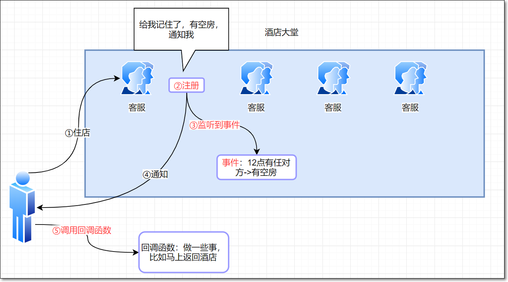
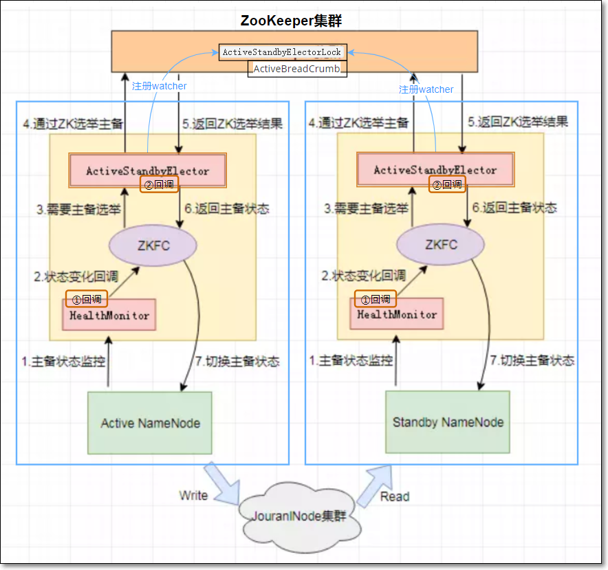
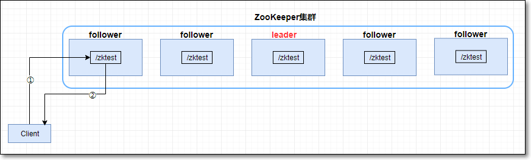

# ZooKeeper分布式协调框架

## 8. HDFS HA方案（20分钟）

### 8.1 ZooKeeper监听器

- 关于ZooKeeper监听器有三个重要的逻辑：

   - **注册**：客户端向ZooKeeper集群注册监听器

   - **监听事件**：监听器负责监听特定的事件

   - **回调函数**：当监听器监听到事件的发生后，调用注册监听器时定义的回调函数

### 8.2 类比举例

- 为了便于理解，举例：旅客住店无房可住的情况

   - 一哥们去酒店办理入住，但是被告知目前无空房
   - 这哥们告诉客服：你给我记住了，帮我留意一下有没有空出的房间，如果有，及时通知我（**类似注册监听器，监听特定事件**）
   - 将近12点，有房客退房，有空闲的房间（**事件**）
   - 客服发现有空房（**监听到事件**）
   - 及时通知这哥们
   - 这哥们收到通知后，**做一些事**，比如马上从附近酒吧赶回酒店（**调用回调函数**）
   
   
   

### 8.3 HDFS HA原理（难点 15分钟）

> 关键逻辑：
>
> ①监听器：**注册、监听事件、回调函数**
>
> ②共享存储：JournalNode

   

- 在Hadoop 1.x版本，HDFS集群的NameNode一直存在单点故障问题：
  - 集群只存在一个NameNode节点，它维护了HDFS所有的元数据信息
  - 当该节点所在服务器宕机或者服务不可用，整个HDFS集群处于不可用状态
  
- Hadoop 2.x版本提出了高可用 (High Availability, HA) 解决方案
  
> HDFS HA方案，主要分两部分：
  >
> ①元数据同步
  >
  > ②主备切换

- <font color='blue'>①元数据同步</font>

  - 在同一个HDFS集群，运行两个互为主备的NameNode节点。
  - 一台为主Namenode节点，处于Active状态，一台为备NameNode节点，处于Standby状态。
  - 其中只有Active NameNode对外提供读写服务，Standby NameNode会根据Active NameNode的状态变化，在必要时**切换**成Active状态。
  - **JournalNode集群**
    - 在主备切换过程中，新的Active NameNode必须确保与原Active NamNode元数据同步完成，才能对外提供服务
    - 所以用JournalNode集群作为共享存储系统；
    - 当客户端对HDFS做操作，会在Active NameNode中edits.log文件中作日志记录，同时日志记录也会写入JournalNode集群；负责存储HDFS新产生的元数据
    - 当有新数据写入JournalNode集群时，Standby NameNode能监听到此情况，将新数据同步过来
    - Active NameNode(写入)和Standby NameNode(读取)实现元数据同步
    - 另外，所有datanode会向两个主备namenode做block report



- <font color='blue'>②主备切换</font>

- **ZKFC涉及角色**

  - 每个NameNode节点上各有一个ZKFC进程
  - ZKFC即ZKFailoverController，作为独立进程存在，负责控制NameNode的主备切换
  - ZKFC会监控NameNode的健康状况，当发现Active NameNode异常时，通过Zookeeper集群进行namenode主备选举，完成Active和Standby状态的切换
    - ZKFC在启动时，同时会初始化HealthMonitor和ActiveStandbyElector服务
    - ZKFC同时会向HealthMonitor和ActiveStandbyElector注册相应的回调方法（如上图的①回调、②回调）
    - **HealthMonitor**定时调用NameNode的HAServiceProtocol RPC接口(monitorHealth和getServiceStatus)，监控NameNode的健康状态，并向ZKFC反馈
    - **ActiveStandbyElector**接收ZKFC的选举请求，通过Zookeeper自动完成namenode主备选举
    - 选举完成后回调ZKFC的主备切换方法对NameNode进行Active和Standby状态的切换
  
- **主备选举过程：**

  - 启动两个NameNode、ZKFC
  - 两个ZKFC通过各自ActiveStandbyElector发起NameNode的主备选举，这个过程利用Zookeeper的写一致性和临时节点机制实现
  - 当发起一次**主备**选举时，ActiveStandbyElector会尝试在Zookeeper创建临时节点`/hadoop-ha/${dfs.nameservices}/ActiveStandbyElectorLock`，Zookeeper的写一致性保证最终只会有一个ActiveStandbyElector创建成功
  - ActiveStandbyElector从ZooKeeper获得选举结果
  - 创建成功的 ActiveStandbyElector回调ZKFC的回调方法②，将对应的NameNode切换为Active NameNode状态
  - 而创建失败的ActiveStandbyElector回调ZKFC的回调方法②，将对应的NameNode切换为Standby NameNode状态
  - 不管是否选举成功，所有ActiveStandbyElector都会在临时节点ActiveStandbyElectorLock上注册一个Watcher监听器，来监听这个节点的状态变化事件
  - 如果Active NameNode对应的HealthMonitor检测到NameNode状态异常时，通知对应ZKFC
  - ZKFC会调用 ActiveStandbyElector 方法，删除在Zookeeper上创建的临时节点ActiveStandbyElectorLock（或者ActvieStandbyElector与ZooKeeper的session断开，临时节点也会被删除，但有可能此时原Active NameNode仍然是active状态）
  - 此时，Standby NameNode的ActiveStandbyElector注册的Watcher就会监听到此节点的 NodeDeleted事件。
  - 收到这个事件后，此ActiveStandbyElector发起主备选举，成功创建临时节点ActiveStandbyElectorLock，如果创建成功，则Standby NameNode被选举为Active NameNode（过程同上）
  
- **如何防止脑裂**

  - 脑裂

    在分布式系统中双主现象又称为脑裂，由于Zookeeper的“假死”、长时间的垃圾回收或其它原因都可能导致双Active NameNode现象，此时两个NameNode都可以对外提供服务，无法保证数据一致性

  - 隔离

    对于生产环境，这种情况的出现是毁灭性的，必须通过自带的**隔离（Fencing）**机制预防此类情况

  - 原理
    - ActiveStandbyElector成功创建ActiveStandbyElectorLock临时节点后，会创建另一个ActiveBreadCrumb持久节点
  
    - ActiveBreadCrumb持久节点保存了Active NameNode的地址信息
  
    - 当Active NameNode在正常的状态下断开Zookeeper Session，会一并删除临时节点ActiveStandbyElectorLock、持久节点ActiveBreadCrumb
  
    - 但是如果ActiveStandbyElector在异常的状态下关闭Zookeeper Session，那么持久节点ActiveBreadCrumb会保留下来（此时有可能由于active NameNode与ZooKeeper通信不畅导致，所以此NameNode**还处于active状态**）
  
    - 当另一个NameNode要由standy变成active状态时，会发现上一个Active NameNode遗留下来的ActiveBreadCrumb节点，那么会回调ZKFailoverController的方法对旧的Active NameNode进行fencing
  
      ①首先ZKFC会尝试调用旧Active NameNode的HAServiceProtocol RPC接口的transitionToStandby方法，看能否将其状态切换为Standby
  
      ②如果transitionToStandby方法切换状态失败，那么就需要执行Hadoop自带的隔离措施，Hadoop目前主要提供两种隔离措施：
      sshfence：SSH to the Active NameNode and kill the process；
      shellfence：run an arbitrary shell command to fence the Active NameNode
  
      ③只有成功地fencing之后，选主成功的ActiveStandbyElector才会回调ZKFC的becomeActive方法transitionToActive将对应的NameNode切换为Active，开始对外提供服务
  


>前情回顾：
>
>- ZooKeeper使用原子广播协议Zab(ZooKeeper Automic Broadcast)，保证分布式一致性
>- 协议Zab协议有两种模式，它们分别是
>  - ①**恢复模式（选主）**：因为ZooKeeper也是主从架构；当ZooKeeper集群没有主的角色leader时，从众多服务器中选举leader时，处于此模式；主要处理内部矛盾，我们称之为**安其内**
>  - ②**广播模式（同步）**：当集群有了leader后，客户端向ZooKeeper集群读写数据时，集群处于此模式；主要处理外部矛盾，我们称之为**攘其外**
>- 事务
>  - 为了保证事务的顺序一致性，ZooKeeper采用了递增的事务id号（zxid）来标识事务，所有提议（proposal）都有zxid
>  - 每次事务的提交，必须符合quorum多数派

## 9. ZooKeeper之攘其外（重点 20分钟）

### 9.1 ZooKeeper集群架构图

- ZooKeeper集群也是主从架构
  - 主角色：leader
  - 从角色：follower或observer；统称为learner


> 客户端与ZK集群交互，主要分两大类操作

### 9.2 读操作



- 常见的读取操作，如ls /查看目录；get /zktest查询ZNode数据

- 读操作

  - 客户端先与某个ZK服务器建立Session

  - 然后，直接从此ZK服务器读取数据，并返回客户端即可

  - 关闭Session

### 9.3 写操作

- 写操作比较复杂；为了便于理解，先举个生活中的例子：去银行存钱
  - 银行柜台共有5个桂圆姐姐，编程从①到⑤，其中①②④⑤是**下属follower**，③是**领导leader**
  - 有两个客户
  - 客户①找到桂圆①，说：昨天少给我存了1000万，现在需要给我加进去
  - 桂圆①说，对不起先生，我没有这么大的权限，请你稍等一下，我向领导**leader**③汇报一下
  - 领导③收到消息后，为了做出英明的决策，要征询下属的意见(**proposal**)①②④⑤
  - 只要有**过半数quorum**（5/2+1=3，包括leader自己）同意，则leader做出决定(**commit**)，同意此事
  - leader告知所有下属follower，你们都记下此事生效
  - 桂圆①答复客户①，说已经给您账号里加了1000万


- 客户端写操作
  
  - ①客户端向zk集群写入数据，如create /kkb；与一个follower建立Session连接，从节点follower01
  
  - ②follower将写请求转发给leader
  
  - ③leader收到消息后，发出**proposal提案**（创建/kkb），每个follower先**记录下**要创建/kkb
  
  - ④超过**半数quorum**（包括leader自己）同意提案，则leader提交**commit提案**，leader本地创建/kkb节点ZNode
  
  - ⑤leader通知所有follower，也commit提案；follower各自在本地创建/kkb
  
  - ⑥follower01响应client
  
    
  

## 10.  ZooKeeper之安其内（重点 15分钟）

### 10.1 **架构问题**


- leader很重要？
- 如果没有leader怎么办？
  - 开始选举新的leader

- **ZooKeeper服务器四种状态：**
    - looking：服务器处于寻找Leader群首的状态

    - leading：服务器作为群首时的状态

    - following：服务器作为follower跟随者时的状态

    - observing：服务器作为观察者时的状态


> leader选举分**两种情况**
>
> - 全新集群leader选举
>
> - 非全新集群leader选举

### 10.2 全新集群leader选举


  - 以3台机器组成的ZooKeeper集群为例 

  - 原则：集群中过**半数**（多数派quorum）Server启动后，才能选举出Leader；

      - 此处quorum数是多少？3/2+1=2
      - 即quorum=集群服务器数除以2，再加1

  - 理解leader选举前，先了解几个概念

        - 选举过程中，每个server需发出投票；投票信息**vote信息**结构为(sid, zxid)

            全新集群，server1~3初始投票信息分别为：
      
            ​	server1 ->  **(1, 0)**
          ​	​server2 ->  **(2, 0)**
          ​	server3 ->  **(3, 0)**
        
    - **leader选举公式**：
    
      ​	server1 vote信息 (sid1,zxid1)
    
      ​	server2 vote信息 (sid2,zxid2)
    
      ​	**①zxid大的server胜出；**
    
      ​	**②若zxid相等，再根据判断sid判断，sid大的胜出**
  
  - 选举leader流程：

    > 假设按照ZK1、ZK2、ZK3的依次启动
    
    - 启动ZK1后，投票给自己，vote信息(1,0)，没有过半数，选举不出leader
    
    - 再启动ZK2；ZK1和ZK2票投给自己及其他服务器；ZK1的投票为(1, 0)，ZK2的投票为(2, 0)
    
    - 处理投票。每个server将收到的多个投票做处理
      - 如ZK1上：ZK1投给自己的票(1,0)与ZK2传过来的票(2,0)比较；
      - 利用**leader选举公式**，因为zxid都为0，相等；所以判断sid最大值；2>1；(2,0)胜出；ZK1更新自己的投票为(2, 0)
      - ZK2也是如此逻辑，ZK2更新自己的投票为(2,0)
    
    - 再次发起投票
      - ZK1、ZK2上的投票都是(2,0)
      - 发起投票后，ZK1上有一个自己的票(2,0)和一票来自ZK2的票(2,0)，这两票都选ZK2为leader
      - ZK2上有一个自己的票(2,0)和一票来自ZK1的票(2,0)，这两票都选ZK2为leader
      - 统计投票。server统计投票信息，是否有半数server投同一个服务器为leader；
        - ZK2当选2票；多数
      - 改变服务器状态。确定Leader后，各服务器更新自己的状态
        - 更改ZK2状态从looking到leading，为Leader
        - 更改ZK1状态从looking到following，为Follower
    
    - 当K3启动时，发现已有Leader，不再选举，直接从LOOKING改为FOLLOWING

### 10.3 非全新集群leader选举


- 选举原理同上比较zxid、sid
- 不再赘述


## 11. ZAB算法（难点考点 30 分钟）

### 11.1 仲裁quorum

- 什么是仲裁quorum？

  - 发起proposal时，只要多数派同意，即可生效

- 为什么要仲裁？

  - 多数据派不需要所有的服务器都响应，proposal就能生效
  - 且能提高集群的响应速度

- quorum数如何选择？

  -    **集群节点数 / 2 + 1**
  - 如3节点的集群：quorum数=3/2+1=2

### 11.2 网络分区、脑裂

  - 网络分区：网络通信故障，集群被分成了2部分

  - 脑裂：

    - 原leader处于一个分区；
    - 另外一个分区选举出新的leader 
    - 集群出现2个leader

### 11.3 ZAB算法

> PAXOS算法 -> RAFT算法 -> ZAB算法
>
> [raft算法动图地址](<http://thesecretlivesofdata.com/raft/#replication>)

- **ZAB与RAFT相似，区别如下：**

  1、zab心跳从follower到leader；raft从leader到follower

  2、zab任期叫epoch；raft叫term

- 一下以RAFT算法动图为例，分析ZAB算法


### 11.4 ZooKeeper服务器个数

- 仲裁模式下，服务器个数最好为奇数个。**why?**


  - 5节点的比6节点的集群
      - 容灾能力一样，
      - quorum小，响应快


## 12. ZooKeeper工作原理（5分钟）

### 12.1写操作流程图


1. 在Client向Follwer发出一个写的请求
2. Follwer把请求发送给Leader
3. Leader接收到以后开始发起投票并通知Follwer进行投票
4. Follwer把投票结果发送给Leader
5. Leader将结果汇总，如果多数同意，则开始写入同时把写入操作通知给Follwer，然后commit
6. Follwer把请求结果返回给Client

### 12.2 ZooKeeper状态同步

完成leader选举后，zk就进入ZooKeeper之间状态同步过程

1. leader构建**NEWLEADER**封包，包含leader中最大的zxid值；广播给其它follower
2. follower收到后，如果自己的最大zxid小于leader的，则需要与leader状态同步；否则不需要
3. leader给需要同步的每个follower创建**LearnerHandler**线程，负责数据同步请求
4. leader主线程等待LearnHandler线程处理结果
5. 只有多数follower完成同步，leader才开始对外服务，响应写请求
6. LearnerHandler线程处理逻辑
   1. 接收follower封包**FOLLOWERINFO**，包含此follower最大zxid（代称f-max-zxid）
   2. f-max-zxid与leader最大zxid（代称l-max-zxid）比较
   3. 若相等，说明当前follower是最新的
   4. 另外，若在判断期间，有没有新提交的proposal
      1. 如果有，那么会发送**DIFF**封包将有差异的数据同步过去.同时将follower没有的数据逐个发送**COMMIT**封包给follower要求记录下来.
      2. 如果follower数据id更大,那么会发送TRUNC封包告知截除多余数据.
      3. 如果这一阶段内没有提交的提议值,直接发送SNAP封包将快照同步发送给follower.
   5. 以上消息完毕之后,发送**UPTODATE**封包告知follower当前数据就是最新的了
   6. 再次发送**NEWLEADER**封包宣称自己是leader,等待follower的响应.


# 五、拓展点、未来计划、行业趋势（15分钟）

## 10. 分布式锁（15分钟）


```shell
create -s -e /locker/node_ ndata
```


## 11. 扩展阅读

[follower与leader状态同步](<https://www.cnblogs.com/hadoop-dev/p/5946870.html>)

[主备切换示例](<https://blog.csdn.net/u010670689/article/details/78054945>)


# 六、总结（10分钟）


# 七、作业


# 八、互动问答


# 九、题库 - 本堂课知识点

1. 假设五台ZooKeeper服务器组成的全新集群，分别为zk1,zk2,zk3,zk4,zk5，sid分别为1、2、3、4、5，依次启动zk1,zk2,zk3,zk4,zk5。问哪台是leader，为什么这台是leader?
3. 同一个客户端同时发起多次请求操作时ZooKeeper内部是如何操作的？多个客户端同时发起多个请求时又是如何操作的？
3. 自己编写代码，完成zookeeper原生API下的增加节点、删除节点、修改节点等操作；其中一个自定义的方法要用到监听器
4. 使用curator API完成增加节点、删除节点、修改节点等操作；其中一个自定义的方法要用到监听器

